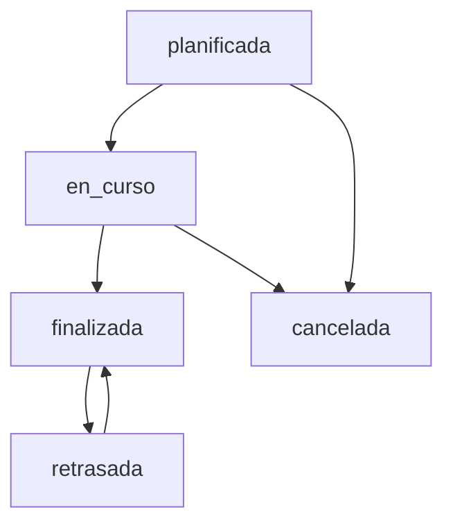
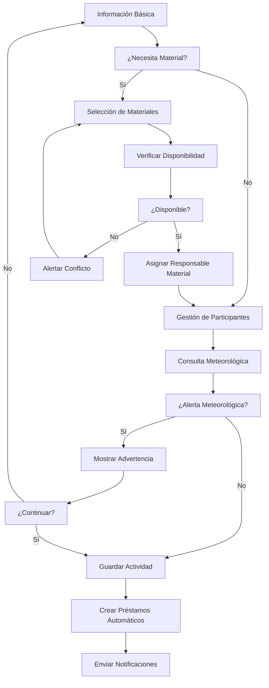

# 🏃‍♂️ Flujo de Gestión de Actividades

## 📋 Resumen

Sistema completo de planificación y gestión de actividades con integración automática de materiales, meteorología y notificaciones.

---

## 🏗️ Arquitectura del Sistema de Actividades

### Componentes Principales
- **ActividadesPage**: Vista principal de actividades
- **ActividadFormPage**: Creación y edición
- **ActividadForm**: Formulario principal
- **MaterialSelector**: Selección de materiales
- **WeatherWidget**: Integración meteorológica
- **ParticipantesManager**: Gestión de participantes

### Servicios Integrados
- **actividadService**: CRUD y lógica de negocio
- **prestamoService**: Gestión automática de préstamos
- **weatherService**: Datos meteorológicos
- **notificacionService**: Alertas y recordatorios

---

## 📊 Estados de Actividad

### Estados Principales
```typescript
type EstadoActividad = 
  | 'planificada'   // Creada, materiales reservados
  | 'en_curso'      // Fecha de inicio alcanzada
  | 'finalizada'    // Completada con materiales devueltos
  | 'cancelada'     // Cancelada manualmente
  | 'retrasada';    // Materiales no devueltos a tiempo
```

### Transiciones Automáticas


---

## 🔄 Flujo Completo de Creación

### 1. Información Básica
```typescript
interface ActividadBase {
  nombre: string;
  descripcion: string;
  ubicacion: {
    nombre: string;
    coordenadas?: { lat: number; lon: number };
  };
  fechaInicio: Date;
  fechaFin: Date;
  responsableActividad: string;
  tipo: 'senderismo' | 'escalada' | 'camping' | 'otro';
}
```

### 2. Flujo de Creación Paso a Paso


### 3. Implementación del Flujo
```typescript
const crearActividad = async (actividadData: ActividadCreate) => {
  // 1. Validaciones iniciales
  await validarDatosActividad(actividadData);
  
  // 2. Verificar disponibilidad de materiales
  if (actividadData.necesidadMaterial) {
    await verificarDisponibilidadMateriales(
      actividadData.materialesSeleccionados,
      actividadData.fechaInicio,
      actividadData.fechaFin
    );
  }
  
  // 3. Obtener datos meteorológicos
  const datosMeteorologicos = await weatherService.getWeatherForDates(
    actividadData.ubicacion.coordenadas,
    actividadData.fechaInicio,
    actividadData.fechaFin
  );
  
  // 4. Guardar actividad
  const actividadRef = await addDoc(collection(db, 'actividades'), {
    ...actividadData,
    estado: 'planificada',
    datosMeteorologicos,
    fechaCreacion: serverTimestamp()
  });
  
  // 5. Procesos automáticos
  await executeTransaction(async () => {
    if (actividadData.necesidadMaterial) {
      await crearPrestamosParaActividad(actividadRef.id, actividadData.materialesSeleccionados);
    }
    await enviarNotificacionesActividad(actividadRef.id, 'nueva_actividad');
  });
  
  return actividadRef.id;
};
```

---

## 🎯 Selección Inteligente de Materiales

### MaterialSelector Avanzado
```typescript
const MaterialSelector = ({ fechaInicio, fechaFin, onSelectionChange }) => {
  const [materialesDisponibles, setMaterialesDisponibles] = useState([]);
  const [conflictos, setConflictos] = useState([]);
  
  // Verificación en tiempo real
  const verificarDisponibilidad = useCallback(async () => {
    const materiales = await obtenerMaterialesDisponibles(fechaInicio, fechaFin);
    const conflictosDetectados = await detectarConflictos(fechaInicio, fechaFin);
    
    setMaterialesDisponibles(materiales);
    setConflictos(conflictosDetectados);
  }, [fechaInicio, fechaFin]);
  
  useEffect(() => {
    if (fechaInicio && fechaFin) {
      verificarDisponibilidad();
    }
  }, [fechaInicio, fechaFin, verificarDisponibilidad]);
  
  // ... resto de la implementación
};
```

### Verificación de Conflictos
```typescript
const detectarConflictos = async (fechaInicio: Date, fechaFin: Date) => {
  // Buscar actividades que se solapen en fechas
  const actividadesConflicto = await db
    .collection('actividades')
    .where('estado', 'in', ['planificada', 'en_curso'])
    .where('fechaInicio', '<=', fechaFin)
    .where('fechaFin', '>=', fechaInicio)
    .get();
  
  // Analizar materiales en conflicto
  const materialesEnUso = [];
  for (const actividad of actividadesConflicto.docs) {
    const prestamos = await obtenerPrestamosPorActividad(actividad.id);
    materialesEnUso.push(...prestamos.map(p => p.materialId));
  }
  
  return materialesEnUso;
};
```

---

## 🌤️ Integración Meteorológica Automática

### WeatherWidget Component
```typescript
const WeatherWidget = ({ ubicacion, fechaInicio, fechaFin }) => {
  const [weatherData, setWeatherData] = useState(null);
  const [alertas, setAlertas] = useState([]);
  
  useEffect(() => {
    const cargarDatosMeteorologicos = async () => {
      if (!ubicacion?.coordenadas) return;
      
      try {
        const datos = await weatherService.getWeatherForDates(
          ubicacion.coordenadas,
          fechaInicio,
          fechaFin
        );
        
        setWeatherData(datos);
        
        // Evaluar alertas
        const alertasGeneradas = evaluarAlertasMeteorologicas(datos);
        setAlertas(alertasGeneradas);
        
      } catch (error) {
        console.error('Error cargando datos meteorológicos:', error);
      }
    };
    
    cargarDatosMeteorologicos();
  }, [ubicacion, fechaInicio, fechaFin]);
  
  return (
    <Box>
      {alertas.length > 0 && (
        <Alert status="warning">
          <AlertIcon />
          <AlertTitle>Alertas Meteorológicas</AlertTitle>
          <AlertDescription>
            {alertas.map(alerta => alerta.mensaje).join(', ')}
          </AlertDescription>
        </Alert>
      )}
      
      {weatherData && (
        <WeatherForecast data={weatherData} />
      )}
    </Box>
  );
};
```

### Evaluación de Alertas
```typescript
const evaluarAlertasMeteorologicas = (weatherData: WeatherData) => {
  const alertas = [];
  
  weatherData.days.forEach(day => {
    // Lluvia intensa
    if (day.precipitation > 20) {
      alertas.push({
        tipo: 'lluvia_intensa',
        fecha: day.date,
        mensaje: `Lluvia intensa prevista (${day.precipitation}mm)`
      });
    }
    
    // Vientos fuertes
    if (day.windSpeed > 50) {
      alertas.push({
        tipo: 'viento_fuerte',
        fecha: day.date,
        mensaje: `Vientos fuertes (${day.windSpeed} km/h)`
      });
    }
    
    // Temperaturas extremas
    if (day.temperatureMax > 35 || day.temperatureMin < -5) {
      alertas.push({
        tipo: 'temperatura_extrema',
        fecha: day.date,
        mensaje: `Temperatura extrema (${day.temperatureMin}°C - ${day.temperatureMax}°C)`
      });
    }
  });
  
  return alertas;
};
```

---

## 👥 Gestión de Participantes

### Estructura de Participantes
```typescript
interface Participante {
  usuarioId: string;
  nombre: string;
  email: string;
  rol: 'responsable' | 'participante' | 'responsable_material';
  confirmacion: 'pendiente' | 'confirmado' | 'cancelado';
  fechaConfirmacion?: Date;
  observaciones?: string;
}
```

### Notificaciones a Participantes
```typescript
const notificarParticipantes = async (actividadId: string, tipo: string) => {
  const actividad = await obtenerActividad(actividadId);
  
  for (const participante of actividad.participantes) {
    await notificacionService.enviarNotificacion({
      usuarioId: participante.usuarioId,
      tipo: 'actividad',
      categoria: tipo,
      titulo: `Actividad: ${actividad.nombre}`,
      mensaje: generarMensajeNotificacion(tipo, actividad),
      actividadId: actividadId
    });
  }
};
```

---

## 🔄 Automatización de Estados

### Verificación Automática de Estados
```typescript
const verificarYActualizarEstadoActividad = async (actividadId: string) => {
  const actividad = await obtenerActividad(actividadId);
  const ahora = new Date();
  
  let nuevoEstado = actividad.estado;
  
  // Transición a "en_curso"
  if (actividad.estado === 'planificada' && ahora >= actividad.fechaInicio) {
    nuevoEstado = 'en_curso';
  }
  
  // Transición a "finalizada" o "retrasada"
  if (actividad.estado === 'en_curso' && ahora > actividad.fechaFin) {
    const materialesDevueltos = await verificarDevolucionCompleta(actividadId);
    nuevoEstado = materialesDevueltos ? 'finalizada' : 'retrasada';
  }
  
  if (nuevoEstado !== actividad.estado) {
    await actualizarEstadoActividad(actividadId, nuevoEstado);
    await notificarCambioEstado(actividadId, nuevoEstado);
  }
};
```

### Tarea Programada
```typescript
// Ejecutar cada hora
setInterval(async () => {
  const actividadesActivas = await obtenerActividadesActivas();
  
  for (const actividad of actividadesActivas) {
    await verificarYActualizarEstadoActividad(actividad.id);
  }
}, 60 * 60 * 1000); // 1 hora
```

---

## 📱 Dashboard de Actividades

### Vista Principal
```typescript
const ActividadesPage = () => {
  const [actividades, setActividades] = useState([]);
  const [filtros, setFiltros] = useState({
    estado: 'todas',
    fechaDesde: null,
    fechaHasta: null,
    responsable: null
  });
  
  const cargarActividades = useCallback(async () => {
    const actividadesFiltradas = await actividadService.listarConFiltros(filtros);
    setActividades(actividadesFiltradas);
  }, [filtros]);
  
  useEffect(() => {
    cargarActividades();
  }, [cargarActividades]);
  
  return (
    <Container maxW="container.xl">
      <VStack spacing={6}>
        <FiltrosActividades 
          filtros={filtros} 
          onChange={setFiltros} 
        />
        
        <Grid templateColumns="repeat(auto-fill, minmax(400px, 1fr))" gap={6}>
          {actividades.map(actividad => (
            <ActividadCard 
              key={actividad.id} 
              actividad={actividad}
              onEdit={() => navegarAEdicion(actividad.id)}
              onCancel={() => cancelarActividad(actividad.id)}
            />
          ))}
        </Grid>
      </VStack>
    </Container>
  );
};
```

### Métricas de Actividades
```typescript
interface MetricasActividades {
  totalActividades: number;
  actividadesPlanificadas: number;
  actividadesEnCurso: number;
  actividadesFinalizadas: number;
  actividadesCanceladas: number;
  participacionPromedio: number;
  materialesEnUso: number;
}

const calcularMetricas = async (): Promise<MetricasActividades> => {
  const actividades = await listarTodasActividades();
  
  return {
    totalActividades: actividades.length,
    actividadesPlanificadas: actividades.filter(a => a.estado === 'planificada').length,
    actividadesEnCurso: actividades.filter(a => a.estado === 'en_curso').length,
    actividadesFinalizadas: actividades.filter(a => a.estado === 'finalizada').length,
    actividadesCanceladas: actividades.filter(a => a.estado === 'cancelada').length,
    participacionPromedio: calcularParticipacionPromedio(actividades),
    materialesEnUso: await contarMaterialesEnUso()
  };
};
```

---

## 🔗 Integración con Préstamos

### Creación Automática de Préstamos
```typescript
const crearPrestamosParaActividad = async (
  actividadId: string, 
  materialesSeleccionados: MaterialSeleccionado[]
) => {
  const operaciones = materialesSeleccionados.map(async (material) => {
    const prestamoData = {
      actividadId,
      materialId: material.materialId,
      cantidad: material.cantidad,
      usuarioId: material.responsableMaterial,
      fechaInicio: material.fechaInicio,
      fechaFin: material.fechaFin,
      estado: 'en_uso',
      tipo: 'automatico'
    };
    
    await prestamoService.crear(prestamoData);
    await materialService.actualizarDisponibilidad(material.materialId, -material.cantidad);
  });
  
  await Promise.all(operaciones);
};
```

### Sincronización de Cambios
```typescript
const sincronizarCambiosActividad = async (actividadId: string, cambios: ActividadUpdate) => {
  // Si cambian las fechas, actualizar préstamos
  if (cambios.fechaInicio || cambios.fechaFin) {
    await actualizarFechasPrestamos(actividadId, cambios.fechaInicio, cambios.fechaFin);
  }
  
  // Si cambian los materiales, gestionar préstamos
  if (cambios.materialesSeleccionados) {
    await reconciliarMaterialesActividad(actividadId, cambios.materialesSeleccionados);
  }
  
  // Si se cancela, liberar materiales
  if (cambios.estado === 'cancelada') {
    await liberarMaterialesActividad(actividadId);
  }
};
```

---

## 📊 Reportes y Análisis

### Reporte de Actividad
```typescript
const generarReporteActividad = async (actividadId: string) => {
  const actividad = await obtenerActividadCompleta(actividadId);
  const prestamos = await obtenerPrestamosPorActividad(actividadId);
  const incidencias = await obtenerIncidenciasPorActividad(actividadId);
  const datosMeteorologicos = actividad.datosMeteorologicos;
  
  return {
    informacionGeneral: {
      nombre: actividad.nombre,
      fechas: `${actividad.fechaInicio.toLocaleDateString()} - ${actividad.fechaFin.toLocaleDateString()}`,
      participantes: actividad.participantes.length,
      responsable: actividad.responsableActividad
    },
    materialesUtilizados: prestamos.map(p => ({
      material: p.materialNombre,
      cantidad: p.cantidad,
      estado: p.estado,
      responsable: p.responsableMaterial
    })),
    incidenciasReportadas: incidencias.length,
    condicionesMeteorologicas: datosMeteorologicos?.resumen,
    conclusiones: actividad.conclusiones
  };
};
```

### Análisis de Tendencias
```typescript
const analizarTendenciasActividades = async (periodo: DateRange) => {
  const actividades = await obtenerActividadesPorPeriodo(periodo);
  
  return {
    actividadesPorMes: agruparPorMes(actividades),
    tiposActividadMasPopulares: contarPorTipo(actividades),
    materialesMasUtilizados: await analizarUsoMateriales(actividades),
    participacionPromedioPorTipo: calcularParticipacionPorTipo(actividades),
    impactoMeteorologico: analizarImpactoMeteorologico(actividades)
  };
};
```

---

## 🔮 Futuras Mejoras

### En Desarrollo
- **Plantillas de Actividad**: Configuraciones predefinidas
- **Integración Calendario**: Sincronización con Google Calendar
- **Check-in Participantes**: Confirmación de asistencia
- **Evaluación Post-Actividad**: Feedback y mejoras

### Optimizaciones
- **Sugerencias Inteligentes**: ML para recomendaciones
- **Optimización de Rutas**: Integración con mapas
- **Alertas Proactivas**: Notificaciones preventivas
- **Análisis Predictivo**: Patrones de uso y demanda

---

**Última actualización**: 28 de junio de 2025  
**Responsable**: Sistema de Gestión de Actividades AppMaterial
