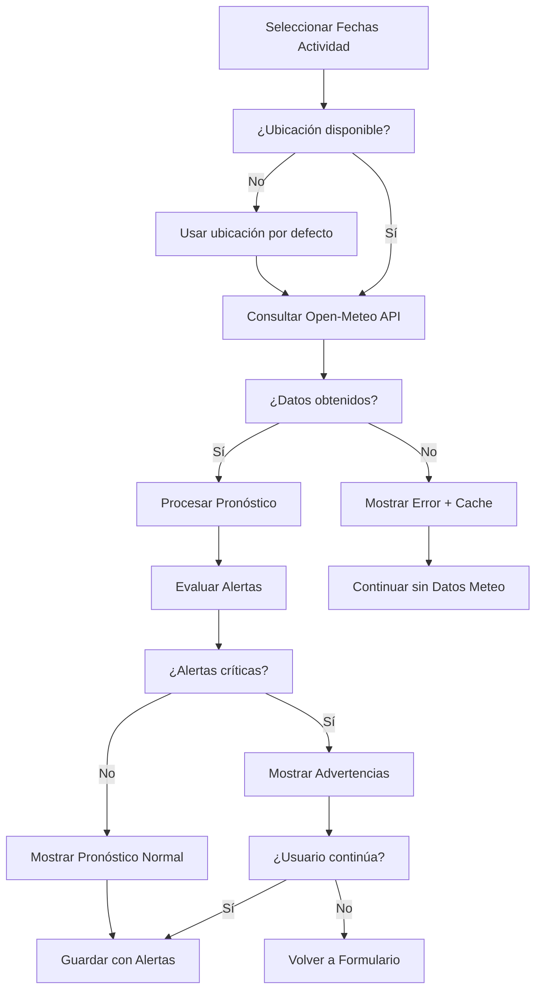

# 🌤️ Flujo de Integración Meteorológica

## 📋 Resumen

Sistema completo de integración meteorológica que proporciona pronósticos, alertas climatológicas y análisis histórico para mejorar la planificación de actividades.

---

## 🏗️ Arquitectura del Sistema Meteorológico

### Componentes Principales
- **WeatherWidget**: Widget principal de clima
- **WeatherForecast**: Pronóstico detallado
- **WeatherAlerts**: Sistema de alertas
- **LocationSelector**: Selector de ubicaciones
- **WeatherHistory**: Historial climatológico

### Servicios Integrados
- **weatherService**: API principal de clima
- **locationService**: Gestión de ubicaciones
- **weatherConfigService**: Configuración meteorológica
- **alertService**: Sistema de alertas climatológicas

---

## 🌐 APIs Meteorológicas Integradas

### Open-Meteo API (Principal)
```typescript
interface OpenMeteoConfig {
  baseUrl: 'https://api.open-meteo.com/v1';
  endpoints: {
    forecast: '/forecast';
    historical: '/historical-weather';
    marine: '/marine';
  };
  features: {
    gratuita: true;
    limitesRed: false;
    cobertura: 'mundial';
    actualizacion: '15 minutos';
  };
}
```

### AEMET API (España - Futuro)
```typescript
interface AEMETConfig {
  baseUrl: 'https://opendata.aemet.es/opendata/api';
  apiKey: string;
  endpoints: {
    prediccion: '/prediccion/especifica/municipio/diaria';
    alertas: '/avisos_cap/ultimo';
    observacion: '/observacion/convencional/datos/estacion';
  };
  features: {
    precision: 'alta';
    alertasOficiales: true;
    cobertura: 'España';
  };
}
```

---

## ⚙️ Configuración del Servicio

### Variables de Configuración
```typescript
interface WeatherConfig {
  enabled: boolean;
  defaultLocation: {
    lat: number;
    lon: number;
    name: string;
  };
  units: {
    temperature: 'celsius' | 'fahrenheit';
    windSpeed: 'kmh' | 'ms' | 'mph';
    precipitation: 'mm' | 'inch';
  };
  alerts: {
    enabled: boolean;
    thresholds: {
      rain: number;        // mm
      wind: number;        // km/h
      tempMax: number;     // °C
      tempMin: number;     // °C
    };
  };
  cache: {
    enabled: boolean;
    ttl: number; // segundos
  };
}
```

### Configuración por Defecto
```typescript
const defaultWeatherConfig: WeatherConfig = {
  enabled: true,
  defaultLocation: {
    lat: 40.4168,
    lon: -3.7038,
    name: "Madrid, España"
  },
  units: {
    temperature: 'celsius',
    windSpeed: 'kmh',
    precipitation: 'mm'
  },
  alerts: {
    enabled: true,
    thresholds: {
      rain: 20,      // 20mm - lluvia intensa
      wind: 50,      // 50 km/h - viento fuerte
      tempMax: 35,   // 35°C - calor extremo
      tempMin: -5    // -5°C - frío extremo
    }
  },
  cache: {
    enabled: true,
    ttl: 3600 // 1 hora
  }
};
```

---

## 🔄 Flujo de Integración en Actividades

### Consulta Automática


### Implementación del WeatherWidget
```typescript
const WeatherWidget: React.FC<WeatherWidgetProps> = ({ 
  ubicacion, 
  fechaInicio, 
  fechaFin,
  onWeatherData,
  onAlertas 
}) => {
  const [weatherData, setWeatherData] = useState<WeatherData | null>(null);
  const [loading, setLoading] = useState(false);
  const [error, setError] = useState<string | null>(null);
  const [alertas, setAlertas] = useState<AlertaMeteorologica[]>([]);
  
  const cargarDatosMeteorologicos = useCallback(async () => {
    if (!ubicacion?.coordenadas || !fechaInicio || !fechaFin) return;
    
    setLoading(true);
    setError(null);
    
    try {
      // Consultar API meteorológica
      const datos = await weatherService.getWeatherForDates(
        ubicacion.coordenadas,
        fechaInicio,
        fechaFin
      );
      
      setWeatherData(datos);
      onWeatherData?.(datos);
      
      // Evaluar alertas climatológicas
      const alertasGeneradas = await evaluarAlertasMeteorologicas(datos);
      setAlertas(alertasGeneradas);
      onAlertas?.(alertasGeneradas);
      
    } catch (err) {
      setError('Error al cargar datos meteorológicos');
      console.error('Error weatherService:', err);
      
      // Intentar cargar desde cache
      const datosCache = await weatherService.getFromCache(
        ubicacion.coordenadas,
        fechaInicio,
        fechaFin
      );
      
      if (datosCache) {
        setWeatherData(datosCache);
        onWeatherData?.(datosCache);
      }
      
    } finally {
      setLoading(false);
    }
  }, [ubicacion, fechaInicio, fechaFin, onWeatherData, onAlertas]);
  
  useEffect(() => {
    cargarDatosMeteorologicos();
  }, [cargarDatosMeteorologicos]);
  
  if (loading) {
    return <WeatherSkeleton />;
  }
  
  if (error && !weatherData) {
    return <WeatherError message={error} onRetry={cargarDatosMeteorologicos} />;
  }
  
  return (
    <WeatherDisplay 
      data={weatherData} 
      alertas={alertas}
      ubicacion={ubicacion}
    />
  );
};
```

---

## 🌡️ Estructura de Datos Meteorológicos

### Datos Principales
```typescript
interface WeatherData {
  location: {
    name: string;
    lat: number;
    lon: number;
    timezone: string;
  };
  current?: {
    temperature: number;
    humidity: number;
    windSpeed: number;
    windDirection: number;
    precipitation: number;
    pressure: number;
    cloudCover: number;
    visibility: number;
    uvIndex: number;
    condition: string;
    icon: string;
  };
  daily: DailyWeather[];
  hourly?: HourlyWeather[];
  alerts?: WeatherAlert[];
  metadata: {
    source: 'open-meteo' | 'aemet';
    lastUpdate: Date;
    cacheTime: Date;
  };
}

interface DailyWeather {
  date: string;
  temperatureMax: number;
  temperatureMin: number;
  precipitation: number;
  precipitationProbability: number;
  windSpeed: number;
  windDirection: number;
  humidity: number;
  pressure: number;
  cloudCover: number;
  uvIndex: number;
  sunrise: string;
  sunset: string;
  condition: string;
  icon: string;
}
```

### Alertas Meteorológicas
```typescript
interface AlertaMeteorologica {
  tipo: 'lluvia_intensa' | 'viento_fuerte' | 'temperatura_extrema' | 'tormenta' | 'nieve' | 'niebla';
  nivel: 'info' | 'warning' | 'danger' | 'critical';
  fecha: string;
  mensaje: string;
  descripcion: string;
  recomendaciones: string[];
  impactoActividad: 'bajo' | 'medio' | 'alto' | 'critico';
}
```

---

## 🚨 Sistema de Evaluación de Alertas

### Evaluador de Alertas
```typescript
const evaluarAlertasMeteorologicas = async (
  weatherData: WeatherData
): Promise<AlertaMeteorologica[]> => {
  const alertas: AlertaMeteorologica[] = [];
  const config = await weatherConfigService.getConfig();
  
  weatherData.daily.forEach(day => {
    // Alerta por lluvia intensa
    if (day.precipitation > config.alerts.thresholds.rain) {
      alertas.push({
        tipo: 'lluvia_intensa',
        nivel: day.precipitation > 50 ? 'critical' : 'warning',
        fecha: day.date,
        mensaje: `Lluvia intensa prevista: ${day.precipitation}mm`,
        descripcion: `Se esperan precipitaciones intensas que pueden afectar la actividad`,
        recomendaciones: [
          'Llevar ropa impermeable',
          'Considerar posponer actividades al aire libre',
          'Verificar rutas alternativas'
        ],
        impactoActividad: day.precipitation > 50 ? 'critico' : 'alto'
      });
    }
    
    // Alerta por vientos fuertes
    if (day.windSpeed > config.alerts.thresholds.wind) {
      alertas.push({
        tipo: 'viento_fuerte',
        nivel: day.windSpeed > 80 ? 'critical' : 'warning',
        fecha: day.date,
        mensaje: `Vientos fuertes: ${day.windSpeed} km/h`,
        descripcion: `Vientos que pueden dificultar las actividades`,
        recomendaciones: [
          'Evitar actividades en altura',
          'Asegurar bien el material',
          'Considerar refugios seguros'
        ],
        impactoActividad: day.windSpeed > 80 ? 'critico' : 'medio'
      });
    }
    
    // Alerta por temperaturas extremas
    if (day.temperatureMax > config.alerts.thresholds.tempMax) {
      alertas.push({
        tipo: 'temperatura_extrema',
        nivel: day.temperatureMax > 40 ? 'critical' : 'warning',
        fecha: day.date,
        mensaje: `Calor extremo: ${day.temperatureMax}°C`,
        descripcion: `Temperaturas que requieren precauciones especiales`,
        recomendaciones: [
          'Hidratación constante',
          'Protección solar',
          'Evitar horas centrales del día',
          'Ropa ligera y transpirable'
        ],
        impactoActividad: 'alto'
      });
    }
    
    if (day.temperatureMin < config.alerts.thresholds.tempMin) {
      alertas.push({
        tipo: 'temperatura_extrema',
        nivel: day.temperatureMin < -10 ? 'critical' : 'warning',
        fecha: day.date,
        mensaje: `Frío extremo: ${day.temperatureMin}°C`,
        descripcion: `Temperaturas que requieren equipamiento especial`,
        recomendaciones: [
          'Ropa de abrigo adecuada',
          'Protección contra congelación',
          'Refugios calefactados',
          'Equipo de emergencia'
        ],
        impactoActividad: 'alto'
      });
    }
    
    // Combinaciones peligrosas
    if (day.precipitation > 10 && day.windSpeed > 30) {
      alertas.push({
        tipo: 'tormenta',
        nivel: 'danger',
        fecha: day.date,
        mensaje: `Tormenta: lluvia ${day.precipitation}mm + viento ${day.windSpeed}km/h`,
        descripcion: `Combinación de lluvia y viento que puede ser peligrosa`,
        recomendaciones: [
          'Cancelar actividades al aire libre',
          'Buscar refugio seguro',
          'No acampar en zonas expuestas'
        ],
        impactoActividad: 'critico'
      });
    }
  });
  
  return alertas;
};
```

### Procesador de Alertas UI
```typescript
const WeatherAlerts: React.FC<{ alertas: AlertaMeteorologica[] }> = ({ alertas }) => {
  if (alertas.length === 0) return null;
  
  const alertasCriticas = alertas.filter(a => a.nivel === 'critical');
  const alertasWarning = alertas.filter(a => a.nivel === 'warning');
  
  return (
    <VStack spacing={3} align="stretch">
      {alertasCriticas.length > 0 && (
        <Alert status="error" borderRadius="md">
          <AlertIcon />
          <Box>
            <AlertTitle>⚠️ Alertas Críticas</AlertTitle>
            <AlertDescription>
              <VStack align="start" spacing={1}>
                {alertasCriticas.map((alerta, index) => (
                  <Text key={index} fontSize="sm">
                    <strong>{alerta.fecha}:</strong> {alerta.mensaje}
                  </Text>
                ))}
              </VStack>
            </AlertDescription>
          </Box>
        </Alert>
      )}
      
      {alertasWarning.length > 0 && (
        <Alert status="warning" borderRadius="md">
          <AlertIcon />
          <Box>
            <AlertTitle>⚡ Condiciones Adversas</AlertTitle>
            <AlertDescription>
              <VStack align="start" spacing={1}>
                {alertasWarning.map((alerta, index) => (
                  <Text key={index} fontSize="sm">
                    <strong>{alerta.fecha}:</strong> {alerta.mensaje}
                  </Text>
                ))}
              </VStack>
            </AlertDescription>
          </Box>
        </Alert>
      )}
      
      <Accordion allowToggle>
        <AccordionItem>
          <AccordionButton>
            <Box flex="1" textAlign="left">
              Ver recomendaciones detalladas
            </Box>
            <AccordionIcon />
          </AccordionButton>
          <AccordionPanel>
            {alertas.map((alerta, index) => (
              <Box key={index} mb={4} p={3} bg="gray.50" borderRadius="md">
                <Text fontWeight="bold">{alerta.tipo.replace('_', ' ').toUpperCase()}</Text>
                <Text fontSize="sm" mb={2}>{alerta.descripcion}</Text>
                <Text fontSize="sm" fontWeight="semibold">Recomendaciones:</Text>
                <UnorderedList fontSize="sm">
                  {alerta.recomendaciones.map((rec, idx) => (
                    <ListItem key={idx}>{rec}</ListItem>
                  ))}
                </UnorderedList>
              </Box>
            ))}
          </AccordionPanel>
        </AccordionItem>
      </Accordion>
    </VStack>
  );
};
```

---

## 📊 WeatherService Implementation

### Servicio Principal
```typescript
class WeatherService {
  private baseUrl = 'https://api.open-meteo.com/v1';
  private cache = new Map<string, CachedWeatherData>();
  
  async getWeatherForDates(
    coordinates: { lat: number; lon: number },
    startDate: Date,
    endDate: Date
  ): Promise<WeatherData> {
    const cacheKey = this.generateCacheKey(coordinates, startDate, endDate);
    
    // Verificar cache
    const cached = this.getFromCacheInternal(cacheKey);
    if (cached && !this.isCacheExpired(cached)) {
      return cached.data;
    }
    
    try {
      // Llamada a API
      const url = this.buildApiUrl(coordinates, startDate, endDate);
      const response = await fetch(url);
      
      if (!response.ok) {
        throw new Error(`API Error: ${response.status}`);
      }
      
      const rawData = await response.json();
      const processedData = this.processApiResponse(rawData, coordinates);
      
      // Guardar en cache
      this.saveToCache(cacheKey, processedData);
      
      return processedData;
      
    } catch (error) {
      console.error('Error fetching weather data:', error);
      
      // Intentar devolver datos de cache aunque estén expirados
      if (cached) {
        console.warn('Using expired cache data due to API error');
        return cached.data;
      }
      
      throw error;
    }
  }
  
  private buildApiUrl(
    coordinates: { lat: number; lon: number },
    startDate: Date,
    endDate: Date
  ): string {
    const params = new URLSearchParams({
      latitude: coordinates.lat.toString(),
      longitude: coordinates.lon.toString(),
      start_date: this.formatDate(startDate),
      end_date: this.formatDate(endDate),
      daily: [
        'temperature_2m_max',
        'temperature_2m_min',
        'precipitation_sum',
        'precipitation_probability_max',
        'wind_speed_10m_max',
        'wind_direction_10m_dominant',
        'relative_humidity_2m_max',
        'surface_pressure',
        'cloud_cover',
        'uv_index_max',
        'sunrise',
        'sunset'
      ].join(','),
      timezone: 'auto',
      forecast_days: '14'
    });
    
    return `${this.baseUrl}/forecast?${params}`;
  }
  
  private processApiResponse(rawData: any, coordinates: { lat: number; lon: number }): WeatherData {
    const daily = rawData.daily;
    const dates = daily.time;
    
    const dailyWeather: DailyWeather[] = dates.map((date: string, index: number) => ({
      date,
      temperatureMax: daily.temperature_2m_max[index],
      temperatureMin: daily.temperature_2m_min[index],
      precipitation: daily.precipitation_sum[index] || 0,
      precipitationProbability: daily.precipitation_probability_max[index] || 0,
      windSpeed: daily.wind_speed_10m_max[index] || 0,
      windDirection: daily.wind_direction_10m_dominant[index] || 0,
      humidity: daily.relative_humidity_2m_max[index] || 0,
      pressure: daily.surface_pressure[index] || 0,
      cloudCover: daily.cloud_cover[index] || 0,
      uvIndex: daily.uv_index_max[index] || 0,
      sunrise: daily.sunrise[index],
      sunset: daily.sunset[index],
      condition: this.determineCondition(daily, index),
      icon: this.getWeatherIcon(daily, index)
    }));
    
    return {
      location: {
        name: `${coordinates.lat.toFixed(2)}, ${coordinates.lon.toFixed(2)}`,
        lat: coordinates.lat,
        lon: coordinates.lon,
        timezone: rawData.timezone || 'UTC'
      },
      daily: dailyWeather,
      metadata: {
        source: 'open-meteo',
        lastUpdate: new Date(),
        cacheTime: new Date()
      }
    };
  }
  
  private determineCondition(daily: any, index: number): string {
    const precipitation = daily.precipitation_sum[index] || 0;
    const cloudCover = daily.cloud_cover[index] || 0;
    
    if (precipitation > 10) return 'rainy';
    if (precipitation > 0) return 'drizzle';
    if (cloudCover > 75) return 'cloudy';
    if (cloudCover > 25) return 'partly-cloudy';
    return 'sunny';
  }
  
  private getWeatherIcon(daily: any, index: number): string {
    const condition = this.determineCondition(daily, index);
    
    const iconMap = {
      'sunny': '☀️',
      'partly-cloudy': '⛅',
      'cloudy': '☁️',
      'drizzle': '🌦️',
      'rainy': '🌧️'
    };
    
    return iconMap[condition] || '🌤️';
  }
}
```

---

## 📍 Gestión de Ubicaciones

### LocationSelector Component
```typescript
const LocationSelector: React.FC<LocationSelectorProps> = ({ 
  onLocationSelect,
  defaultLocation 
}) => {
  const [searchTerm, setSearchTerm] = useState('');
  const [suggestions, setSuggestions] = useState<Location[]>([]);
  const [selectedLocation, setSelectedLocation] = useState<Location | null>(defaultLocation);
  
  const buscarUbicaciones = useCallback(
    debounce(async (term: string) => {
      if (term.length < 3) {
        setSuggestions([]);
        return;
      }
      
      try {
        // Usar servicio de geocodificación
        const resultados = await locationService.searchLocations(term);
        setSuggestions(resultados);
      } catch (error) {
        console.error('Error buscando ubicaciones:', error);
        setSuggestions([]);
      }
    }, 300),
    []
  );
  
  useEffect(() => {
    buscarUbicaciones(searchTerm);
  }, [searchTerm, buscarUbicaciones]);
  
  const handleLocationSelect = (location: Location) => {
    setSelectedLocation(location);
    onLocationSelect(location);
    setSuggestions([]);
  };
  
  return (
    <Box position="relative">
      <Input
        placeholder="Buscar ubicación..."
        value={searchTerm}
        onChange={(e) => setSearchTerm(e.target.value)}
      />
      
      {suggestions.length > 0 && (
        <Box
          position="absolute"
          top="100%"
          left={0}
          right={0}
          bg="white"
          border="1px solid"
          borderColor="gray.200"
          borderRadius="md"
          shadow="md"
          zIndex={1000}
          maxH="200px"
          overflowY="auto"
        >
          {suggestions.map((location, index) => (
            <Box
              key={index}
              p={3}
              cursor="pointer"
              _hover={{ bg: 'gray.100' }}
              onClick={() => handleLocationSelect(location)}
            >
              <Text fontWeight="semibold">{location.name}</Text>
              <Text fontSize="sm" color="gray.600">
                {location.country} • {location.lat.toFixed(2)}, {location.lon.toFixed(2)}
              </Text>
            </Box>
          ))}
        </Box>
      )}
      
      {selectedLocation && (
        <Box mt={2} p={2} bg="blue.50" borderRadius="md">
          <Text fontSize="sm">
            📍 {selectedLocation.name}
          </Text>
        </Box>
      )}
    </Box>
  );
};
```

---

## 📊 Historial y Análisis Meteorológico

### WeatherHistory Component
```typescript
const WeatherHistory: React.FC<{ actividadId: string }> = ({ actividadId }) => {
  const [historialMeteo, setHistorialMeteo] = useState<HistorialMeteorologico | null>(null);
  const [loading, setLoading] = useState(true);
  
  useEffect(() => {
    const cargarHistorial = async () => {
      try {
        const historial = await weatherService.getHistorialActividad(actividadId);
        setHistorialMeteo(historial);
      } catch (error) {
        console.error('Error cargando historial meteorológico:', error);
      } finally {
        setLoading(false);
      }
    };
    
    cargarHistorial();
  }, [actividadId]);
  
  if (loading) return <Skeleton height="200px" />;
  if (!historialMeteo) return <Text>No hay datos meteorológicos disponibles</Text>;
  
  return (
    <Box>
      <Heading size="md" mb={4}>Condiciones Meteorológicas</Heading>
      
      <SimpleGrid columns={{ base: 1, md: 2 }} spacing={4} mb={4}>
        <StatGroup>
          <Stat>
            <StatLabel>Temperatura Promedio</StatLabel>
            <StatNumber>{historialMeteo.temperaturaPromedio.toFixed(1)}°C</StatNumber>
          </Stat>
          <Stat>
            <StatLabel>Precipitación Total</StatLabel>
            <StatNumber>{historialMeteo.precipitacionTotal}mm</StatNumber>
          </Stat>
        </StatGroup>
        
        <StatGroup>
          <Stat>
            <StatLabel>Viento Máximo</StatLabel>
            <StatNumber>{historialMeteo.vientoMaximo} km/h</StatNumber>
          </Stat>
          <Stat>
            <StatLabel>Días con Lluvia</StatLabel>
            <StatNumber>{historialMeteo.diasLluvia}</StatNumber>
          </Stat>
        </StatGroup>
      </SimpleGrid>
      
      {historialMeteo.alertasActivadas.length > 0 && (
        <Alert status="warning" mb={4}>
          <AlertIcon />
          <AlertTitle>Alertas Activadas</AlertTitle>
          <AlertDescription>
            {historialMeteo.alertasActivadas.map(alerta => alerta.mensaje).join(', ')}
          </AlertDescription>
        </Alert>
      )}
      
      <WeatherChart data={historialMeteo.datosDetallados} />
    </Box>
  );
};
```

---

## 🔧 Configuración Avanzada

### Panel de Configuración Meteorológica
```typescript
const WeatherConfigPanel = () => {
  const { data: config, save: saveConfig, loading } = useUnifiedConfig(
    'meteorologia',
    defaultWeatherConfig
  );
  
  const [localConfig, setLocalConfig] = useState(config);
  
  useEffect(() => {
    setLocalConfig(config);
  }, [config]);
  
  const handleSave = async () => {
    try {
      await saveConfig(localConfig);
      toast({
        title: 'Configuración guardada',
        status: 'success',
        duration: 3000
      });
    } catch (error) {
      toast({
        title: 'Error al guardar',
        description: error.message,
        status: 'error',
        duration: 5000
      });
    }
  };
  
  return (
    <VStack spacing={6} align="stretch">
      <Heading size="lg">Configuración Meteorológica</Heading>
      
      <FormControl>
        <FormLabel>Servicio Meteorológico Habilitado</FormLabel>
        <Switch
          isChecked={localConfig.enabled}
          onChange={(e) => setLocalConfig({
            ...localConfig,
            enabled: e.target.checked
          })}
        />
      </FormControl>
      
      <Box>
        <FormLabel>Ubicación por Defecto</FormLabel>
        <LocationSelector
          onLocationSelect={(location) => setLocalConfig({
            ...localConfig,
            defaultLocation: location
          })}
          defaultLocation={localConfig.defaultLocation}
        />
      </Box>
      
      <SimpleGrid columns={{ base: 1, md: 2 }} spacing={4}>
        <FormControl>
          <FormLabel>Unidad de Temperatura</FormLabel>
          <Select
            value={localConfig.units.temperature}
            onChange={(e) => setLocalConfig({
              ...localConfig,
              units: {
                ...localConfig.units,
                temperature: e.target.value as 'celsius' | 'fahrenheit'
              }
            })}
          >
            <option value="celsius">Celsius (°C)</option>
            <option value="fahrenheit">Fahrenheit (°F)</option>
          </Select>
        </FormControl>
        
        <FormControl>
          <FormLabel>Unidad de Velocidad del Viento</FormLabel>
          <Select
            value={localConfig.units.windSpeed}
            onChange={(e) => setLocalConfig({
              ...localConfig,
              units: {
                ...localConfig.units,
                windSpeed: e.target.value as 'kmh' | 'ms' | 'mph'
              }
            })}
          >
            <option value="kmh">Km/h</option>
            <option value="ms">m/s</option>
            <option value="mph">mph</option>
          </Select>
        </FormControl>
      </SimpleGrid>
      
      <Box>
        <Heading size="md" mb={4}>Umbrales de Alerta</Heading>
        <SimpleGrid columns={{ base: 1, md: 2 }} spacing={4}>
          <FormControl>
            <FormLabel>Lluvia Intensa (mm)</FormLabel>
            <NumberInput
              value={localConfig.alerts.thresholds.rain}
              onChange={(_, value) => setLocalConfig({
                ...localConfig,
                alerts: {
                  ...localConfig.alerts,
                  thresholds: {
                    ...localConfig.alerts.thresholds,
                    rain: value
                  }
                }
              })}
            >
              <NumberInputField />
            </NumberInput>
          </FormControl>
          
          <FormControl>
            <FormLabel>Viento Fuerte (km/h)</FormLabel>
            <NumberInput
              value={localConfig.alerts.thresholds.wind}
              onChange={(_, value) => setLocalConfig({
                ...localConfig,
                alerts: {
                  ...localConfig.alerts,
                  thresholds: {
                    ...localConfig.alerts.thresholds,
                    wind: value
                  }
                }
              })}
            >
              <NumberInputField />
            </NumberInput>
          </FormControl>
          
          <FormControl>
            <FormLabel>Temperatura Máxima (°C)</FormLabel>
            <NumberInput
              value={localConfig.alerts.thresholds.tempMax}
              onChange={(_, value) => setLocalConfig({
                ...localConfig,
                alerts: {
                  ...localConfig.alerts,
                  thresholds: {
                    ...localConfig.alerts.thresholds,
                    tempMax: value
                  }
                }
              })}
            >
              <NumberInputField />
            </NumberInput>
          </FormControl>
          
          <FormControl>
            <FormLabel>Temperatura Mínima (°C)</FormLabel>
            <NumberInput
              value={localConfig.alerts.thresholds.tempMin}
              onChange={(_, value) => setLocalConfig({
                ...localConfig,
                alerts: {
                  ...localConfig.alerts,
                  thresholds: {
                    ...localConfig.alerts.thresholds,
                    tempMin: value
                  }
                }
              })}
            >
              <NumberInputField />
            </NumberInput>
          </FormControl>
        </SimpleGrid>
      </Box>
      
      <Button
        colorScheme="blue"
        onClick={handleSave}
        isLoading={loading}
        loadingText="Guardando..."
      >
        Guardar Configuración
      </Button>
    </VStack>
  );
};
```

---

## 📊 Métricas y Análisis

### Análisis de Impacto Meteorológico
```typescript
const analizarImpactoMeteorologico = async (actividades: Actividad[]) => {
  const analisis = {
    actividadesCanceladas: 0,
    actividadesConAlertas: 0,
    diasLluviososPromedio: 0,
    temperaturaPromedioActividades: 0,
    condicionesMasFrecuentes: {},
    impactoPorTipoActividad: {}
  };
  
  for (const actividad of actividades) {
    if (actividad.datosMeteorologicos) {
      const datos = actividad.datosMeteorologicos;
      
      // Analizar alertas
      if (datos.alertas && datos.alertas.length > 0) {
        analisis.actividadesConAlertas++;
        
        if (datos.alertas.some(a => a.nivel === 'critical')) {
          analisis.actividadesCanceladas++;
        }
      }
      
      // Calcular promedios
      const tempPromedio = datos.daily.reduce((sum, day) => 
        sum + (day.temperatureMax + day.temperatureMin) / 2, 0
      ) / datos.daily.length;
      
      analisis.temperaturaPromedioActividades += tempPromedio;
      
      // Contar días lluviosos
      const diasLluvia = datos.daily.filter(day => day.precipitation > 0).length;
      analisis.diasLluviososPromedio += diasLluvia;
      
      // Condiciones más frecuentes
      datos.daily.forEach(day => {
        analisis.condicionesMasFrecuentes[day.condition] = 
          (analisis.condicionesMasFrecuentes[day.condition] || 0) + 1;
      });
    }
  }
  
  // Calcular promedios finales
  if (actividades.length > 0) {
    analisis.temperaturaPromedioActividades /= actividades.length;
    analisis.diasLluviososPromedio /= actividades.length;
  }
  
  return analisis;
};
```

---

## 🔮 Futuras Mejoras

### En Desarrollo
- **Integración AEMET**: API oficial española con alertas oficiales
- **Predicción a 15 días**: Pronósticos extendidos
- **Alertas Push**: Notificaciones móviles de cambios meteorológicos
- **Mapas Meteorológicos**: Visualización geográfica

### Optimizaciones
- **Machine Learning**: Predicción de cancelaciones por clima
- **Análisis Histórico**: Patrones estacionales de actividades
- **Integración Satelital**: Imágenes en tiempo real
- **API Múltiple**: Agregación de varias fuentes meteorológicas

---

**Última actualización**: 28 de junio de 2025  
**Responsable**: Sistema Meteorológico AppMaterial
