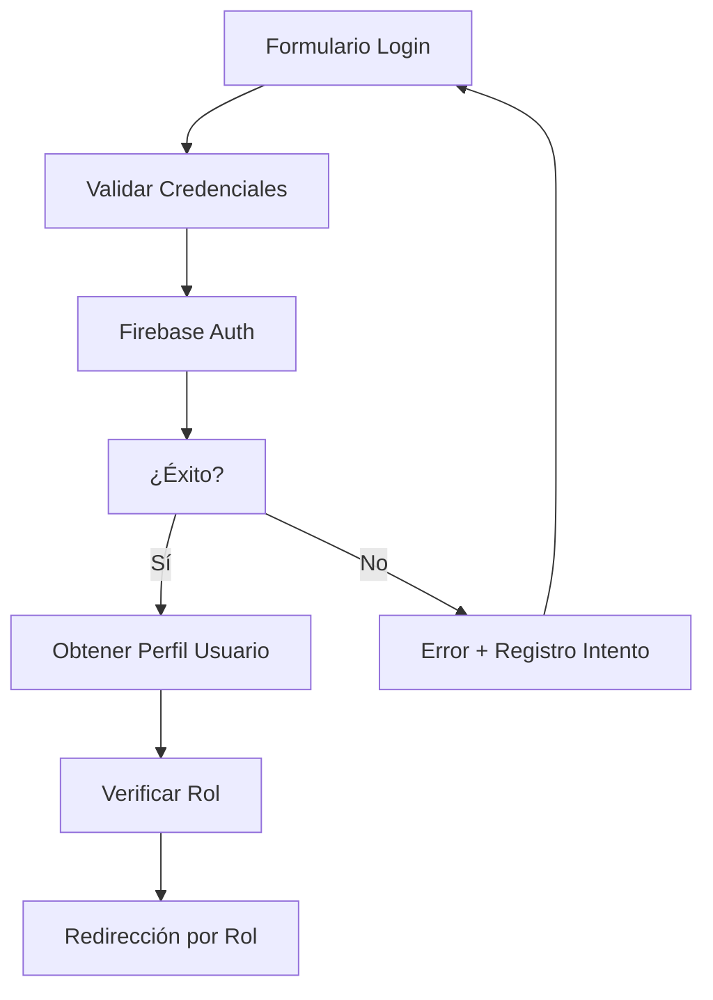

# 🔐 Flujo de Autenticación y Autorización

## 📋 Resumen

Sistema completo de autenticación basado en Firebase Auth con gestión de roles y permisos granulares.

---

## 🏗️ Arquitectura del Sistema de Autenticación

### Componentes Principales
- **AuthContext**: Contexto global de autenticación
- **ProtectedRoute**: Protección de rutas por rol
- **LoginPage**: Formulario de acceso
- **AppNavigationMenu**: Navegación adaptada por rol

### Servicios Integrados
- **Firebase Auth**: Autenticación externa
- **usuarioService**: Gestión de perfiles
- **loginAttemptService**: Control de intentos

---

## 🔄 Flujo Completo de Login

### 1. Acceso Inicial
```
Usuario accede → "/" → ¿Sesión activa? → No → Redirect "/login"
```

### 2. Proceso de Autenticación


### 3. Redirección Automática por Rol
```typescript
const getRutaPorRol = (rol: string) => {
  switch (rol) {
    case 'admin': return '/admin';
    case 'vocal': return '/vocal';
    case 'socio': return '/socio';
    default: return '/dashboard';
  }
};
```

---

## 🛡️ Sistema de Autorización

### Matriz de Permisos
| **Funcionalidad** | **Admin** | **Vocal** | **Socio** | **Invitado** |
|-------------------|-----------|-----------|-----------|--------------|
| Gestión Usuarios | ✅ | ✅ | ❌ | ❌ |
| Gestión Material | ✅ | ✅ | ❌ | ❌ |
| Crear Actividades | ✅ | ✅ | ✅ | ❌ |
| Ver Inventario | ✅ | ✅ | ✅ | ❌ |
| Mensajería | ✅ | ✅ | ✅ | ✅ |
| Configuración | ✅ | ✅ | ❌ | ❌ |
| Reportes | ✅ | ✅ | ❌ | ❌ |

### ProtectedRoute Component
```typescript
interface ProtectedRouteProps {
  children: React.ReactNode;
  allowedRoles: string[];
}

const ProtectedRoute: React.FC<ProtectedRouteProps> = ({ 
  children, 
  allowedRoles 
}) => {
  const { userProfile } = useAuth();
  
  if (!allowedRoles.includes(userProfile.rol)) {
    navigate(getRutaPorRol(userProfile.rol));
    return null;
  }
  
  return <>{children}</>;
};
```

---

## 🔑 AuthContext Implementation

### Estado Global
```typescript
interface AuthContextType {
  currentUser: User | null;
  userProfile: UserProfile | null;
  loading: boolean;
  login: (email: string, password: string) => Promise<void>;
  logout: () => Promise<void>;
  resetPassword: (email: string) => Promise<void>;
}
```

### Persistencia de Sesión
```typescript
useEffect(() => {
  const unsubscribe = onAuthStateChanged(auth, async (user) => {
    if (user) {
      const userProfile = await obtenerOCrearUsuario(user.uid);
      setUserProfile(userProfile);
      // Cargar notificaciones pendientes
      // Inicializar listeners de mensajería
    } else {
      setUserProfile(null);
    }
    setLoading(false);
  });
  
  return unsubscribe;
}, []);
```

---

## 🎯 Integración con Otros Sistemas

### Al Completar Login
1. **Cargar Notificaciones**: Notificaciones pendientes del usuario
2. **Inicializar Mensajería**: Listeners de conversaciones activas
3. **Configuración Personal**: Preferencias del usuario
4. **Cache de Datos**: Materiales y actividades relevantes

### Gestión de Sesión
```typescript
// Configuración de persistencia
await setPersistence(auth, browserLocalPersistence);

// Auto-refresh de tokens
auth.onIdTokenChanged(async (user) => {
  if (user) {
    const token = await user.getIdToken(true);
    // Actualizar headers de API calls
  }
});
```

---

## 🔧 Configuración de Firebase Auth

### Variables de Entorno
```env
REACT_APP_FIREBASE_API_KEY=
REACT_APP_FIREBASE_AUTH_DOMAIN=
REACT_APP_FIREBASE_PROJECT_ID=
```

### Configuración de Seguridad
```javascript
// firebase.js
const auth = getAuth(app);
auth.useDeviceLanguage(); // Idioma automático
```

---

## 🚨 Manejo de Errores

### Tipos de Error
```typescript
const handleAuthError = (error: FirebaseError) => {
  switch (error.code) {
    case 'auth/user-not-found':
      return 'Usuario no encontrado';
    case 'auth/wrong-password':
      return 'Contraseña incorrecta';
    case 'auth/too-many-requests':
      return 'Demasiados intentos. Intenta más tarde';
    case 'auth/user-disabled':
      return 'Cuenta deshabilitada';
    default:
      return 'Error de autenticación';
  }
};
```

### Control de Intentos Fallidos
```typescript
// loginAttemptService.ts
export const registrarIntentoFallido = async (email: string) => {
  const intentos = await obtenerIntentos(email);
  if (intentos >= 5) {
    // Bloquear temporalmente
    await bloquearUsuario(email, 30); // 30 minutos
  }
};
```

---

## 📱 Navegación Adaptiva

### AppNavigationMenu
```typescript
const getMenuItemsByRole = (role: string) => {
  const baseItems = [
    { path: '/dashboard', label: 'Dashboard', roles: ['all'] },
    { path: '/mensajeria', label: 'Mensajes', roles: ['all'] }
  ];
  
  const adminItems = [
    { path: '/admin/usuarios', label: 'Usuarios', roles: ['admin', 'vocal'] },
    { path: '/admin/configuracion', label: 'Config', roles: ['admin'] }
  ];
  
  return filterMenuByRole(baseItems.concat(adminItems), role);
};
```

---

## 🔄 Flujos de Casos Especiales

### Primer Login
1. Usuario creado por Admin → Estado `pendiente_activacion`
2. Email de bienvenida → Link de activación
3. Completar perfil → Cambio de contraseña obligatorio
4. Activación completa → Acceso normal

### Recuperación de Contraseña
1. Formulario de recuperación → Email válido
2. Firebase Auth → Envío de email
3. Link de reseteo → Nueva contraseña
4. Confirmación → Login automático

### Cambio de Rol
1. Admin modifica rol → Actualización en Firestore
2. Evento real-time → AuthContext actualizado
3. Redirección automática → Nueva ruta por rol
4. Permisos aplicados → Inmediato

---

## 📊 Métricas y Monitorización

### KPIs de Autenticación
- **Tasa de éxito de login**: 95%+
- **Tiempo de autenticación**: <2 segundos
- **Intentos fallidos**: <5% del total
- **Sesiones activas**: Monitoreo real-time

### Logs de Seguridad
```typescript
// Registro de eventos de seguridad
const logSecurityEvent = async (event: SecurityEvent) => {
  await addDoc(collection(db, 'security_logs'), {
    ...event,
    timestamp: serverTimestamp(),
    userAgent: navigator.userAgent,
    ip: await getUserIP()
  });
};
```

---

## 🔮 Futuras Mejoras

### En Desarrollo
- **2FA (Two-Factor Authentication)**: SMS + Email
- **OAuth Providers**: Google, Microsoft
- **Biometric Auth**: Huella digital en móviles
- **Single Sign-On (SSO)**: Integración empresarial

### Optimizaciones
- **Lazy Loading**: Carga diferida de permisos
- **Token Refresh**: Automático en segundo plano
- **Session Analytics**: Análisis de uso
- **Security Monitoring**: Detección de anomalías

---

**Última actualización**: 28 de junio de 2025  
**Responsable**: Sistema de Autenticación AppMaterial
