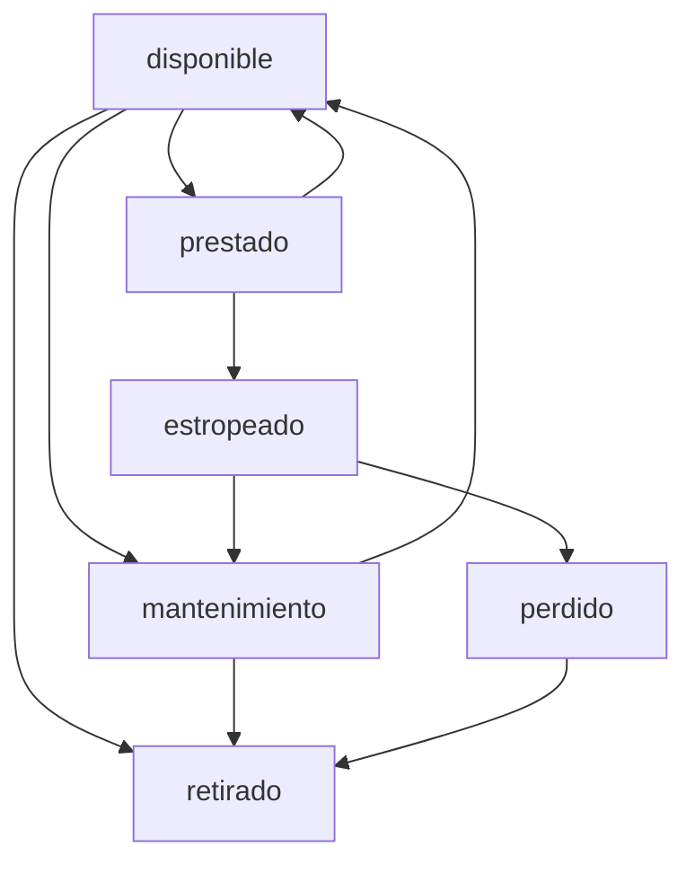
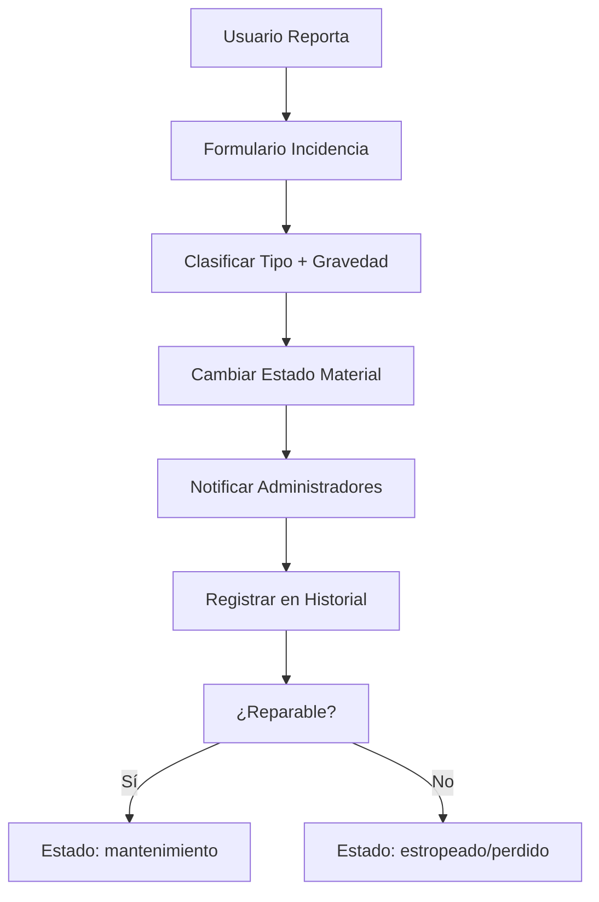

# 📦 Flujo de Gestión de Materiales

## 📋 Resumen

Sistema completo de gestión de inventario con estados dinámicos, historial de eventos y control de disponibilidad en tiempo real.

---

## 🏗️ Arquitectura del Sistema de Materiales

### Componentes Principales
- **DashboardMateriales**: Vista principal del inventario
- **MaterialInventoryPage**: Gestión completa de materiales
- **MaterialCard**: Representación visual de cada material
- **MaterialSelector**: Selección para actividades
- **MaterialForm**: Creación y edición

### Servicios Integrados
- **MaterialService**: CRUD y lógica de negocio
- **MaterialImportService**: Importación masiva
- **MaterialExportService**: Exportación de datos
- **cacheService**: Optimización de rendimiento

---

## 📊 Estados de Material

### Estados Principales
```typescript
type EstadoMaterial = 
  | 'disponible'    // Listo para préstamo
  | 'prestado'      // Actualmente en uso
  | 'mantenimiento' // Requiere revisión
  | 'estropeado'    // No disponible por incidencia
  | 'perdido'       // Material no recuperable
  | 'retirado';     // Dado de baja permanente
```

### Transiciones de Estado


---

## 🔄 Flujo CRUD de Materiales

### 1. Crear Material
```typescript
const crearMaterial = async (materialData: MaterialCreate) => {
  // Validación de datos
  await validarDatosMaterial(materialData);
  
  // Generación de código único
  const codigo = await generarCodigoUnico();
  
  // Creación en Firestore
  const materialRef = await addDoc(collection(db, 'materiales'), {
    ...materialData,
    codigo,
    estado: 'disponible',
    cantidadDisponible: materialData.cantidad,
    fechaCreacion: serverTimestamp(),
    historial: []
  });
  
  // Registro en historial
  await registrarEventoMaterial(materialRef.id, 'creacion', 'Material creado');
  
  // Invalidar cache
  await cacheService.invalidatePattern('materiales_*');
  
  return materialRef.id;
};
```

### 2. Actualizar Disponibilidad
```typescript
const actualizarDisponibilidad = async (materialId: string, cambio: number) => {
  await runTransaction(db, async (transaction) => {
    const materialRef = doc(db, 'materiales', materialId);
    const material = await transaction.get(materialRef);
    
    if (!material.exists()) {
      throw new Error('Material no encontrado');
    }
    
    const nuevaCantidad = material.data().cantidadDisponible + cambio;
    
    if (nuevaCantidad < 0) {
      throw new Error('No hay suficiente cantidad disponible');
    }
    
    transaction.update(materialRef, {
      cantidadDisponible: nuevaCantidad,
      ultimaActualizacion: serverTimestamp()
    });
    
    // Actualizar estado automático
    if (nuevaCantidad === 0 && material.data().estado === 'disponible') {
      transaction.update(materialRef, { estado: 'prestado' });
    } else if (nuevaCantidad > 0 && material.data().estado === 'prestado') {
      transaction.update(materialRef, { estado: 'disponible' });
    }
  });
};
```

---

## 🔍 Sistema de Búsqueda y Filtros

### Filtros Disponibles
```typescript
interface FiltrosMaterial {
  categoria?: string;
  estado?: EstadoMaterial;
  responsable?: string;
  ubicacion?: string;
  fechaDesde?: Date;
  fechaHasta?: Date;
  disponiblePara?: Date; // Para actividades futuras
}
```

### Búsqueda Avanzada
```typescript
const buscarMateriales = async (filtros: FiltrosMaterial) => {
  let query = collection(db, 'materiales');
  
  // Aplicar filtros
  if (filtros.categoria) {
    query = query.where('categoria', '==', filtros.categoria);
  }
  
  if (filtros.estado) {
    query = query.where('estado', '==', filtros.estado);
  }
  
  if (filtros.disponiblePara) {
    // Verificar disponibilidad para fecha específica
    query = query.where('estado', 'in', ['disponible', 'mantenimiento']);
  }
  
  const snapshot = await getDocs(query);
  return snapshot.docs.map(doc => ({
    id: doc.id,
    ...doc.data()
  }));
};
```

---

## 🚨 Sistema de Incidencias

### Tipos de Incidencia
```typescript
type TipoIncidencia = 
  | 'rotura'      // Material dañado
  | 'perdida'     // Material extraviado
  | 'desgaste'    // Deterioro normal
  | 'mal_uso'     // Uso inadecuado
  | 'otro';       // Otras causas
```

### Flujo de Reporte de Incidencias


### Registro de Incidencia
```typescript
const reportarIncidencia = async (incidencia: IncidenciaCreate) => {
  const incidenciaRef = await addDoc(collection(db, 'incidencias'), {
    ...incidencia,
    fechaReporte: serverTimestamp(),
    estado: 'pendiente',
    reportadoPor: auth.currentUser?.uid
  });
  
  // Cambiar estado del material
  await actualizarEstadoMaterial(
    incidencia.materialId, 
    determinarNuevoEstado(incidencia.tipo, incidencia.gravedad)
  );
  
  // Notificar automáticamente
  await notificarIncidencia(incidencia);
  
  return incidenciaRef.id;
};
```

---

## 📈 Historial de Material

### Eventos Registrados
```typescript
interface EventoMaterial {
  tipo: 'creacion' | 'prestamo' | 'devolucion' | 'incidencia' | 'mantenimiento';
  descripcion: string;
  fecha: Timestamp;
  usuario: string;
  actividadId?: string;
  prestamoId?: string;
  incidenciaId?: string;
}
```

### Generación de Historial
```typescript
const generarHistorialMaterial = async (materialId: string) => {
  const eventos = await Promise.all([
    obtenerEventosPrestamo(materialId),
    obtenerEventosIncidencia(materialId),
    obtenerEventosMantenimiento(materialId)
  ]);
  
  const historialCompleto = eventos
    .flat()
    .sort((a, b) => b.fecha.toMillis() - a.fecha.toMillis());
  
  return historialCompleto;
};
```

---

## 🔄 Integración con Sistema de Préstamos

### Reserva Automática
```typescript
// Al crear actividad con materiales
const reservarMaterialesParaActividad = async (
  actividadId: string, 
  materiales: MaterialSolicitado[]
) => {
  const operaciones = materiales.map(async (material) => {
    // Verificar disponibilidad
    const disponible = await verificarDisponibilidad(
      material.materialId,
      material.cantidad,
      material.fechaInicio,
      material.fechaFin
    );
    
    if (!disponible) {
      throw new Error(`Material ${material.nombre} no disponible`);
    }
    
    // Crear préstamo automático
    await crearPrestamoAutomatico(actividadId, material);
    
    // Actualizar disponibilidad
    await actualizarDisponibilidad(material.materialId, -material.cantidad);
  });
  
  await Promise.all(operaciones);
};
```

### Liberación Automática
```typescript
// Al devolver materiales o finalizar actividad
const liberarMaterialesDeActividad = async (actividadId: string) => {
  const prestamos = await obtenerPrestamosPorActividad(actividadId);
  
  for (const prestamo of prestamos) {
    if (prestamo.estado === 'en_uso') {
      await procesarDevolucion(prestamo.id, {
        estado: 'devuelto',
        fechaDevolucion: new Date(),
        observaciones: 'Devolución automática al finalizar actividad'
      });
    }
  }
};
```

---

## 🏷️ Sistema de Categorías

### Categorías Principales
```typescript
const categorias = [
  'tiendas_camping',
  'sacos_dormir',
  'mochilas',
  'material_cocina',
  'cuerdas_escalada',
  'material_montaña',
  'primeros_auxilios',
  'herramientas',
  'electronico',
  'otros'
];
```

### Gestión Dinámica
```typescript
// Las categorías se pueden gestionar desde configuración
const obtenerCategorias = async () => {
  const config = await systemConfig.loadConfig('categorias_material');
  return config.categorias || categorias;
};
```

---

## 📊 Dashboard de Materiales

### Métricas Principales
```typescript
interface MetricasMaterial {
  totalMateriales: number;
  materialesDisponibles: number;
  materialesPrestados: number;
  materialesMantenimiento: number;
  materialesEstropeados: number;
  porcentajeDisponibilidad: number;
  incidenciasPendientes: number;
}
```

### Calculadora de Métricas
```typescript
const calcularMetricas = async (): Promise<MetricasMaterial> => {
  const materiales = await listarTodosMateriales();
  
  return {
    totalMateriales: materiales.length,
    materialesDisponibles: materiales.filter(m => m.estado === 'disponible').length,
    materialesPrestados: materiales.filter(m => m.estado === 'prestado').length,
    materialesMantenimiento: materiales.filter(m => m.estado === 'mantenimiento').length,
    materialesEstropeados: materiales.filter(m => m.estado === 'estropeado').length,
    porcentajeDisponibilidad: calcularPorcentajeDisponibilidad(materiales),
    incidenciasPendientes: await contarIncidenciasPendientes()
  };
};
```

---

## 🔍 MaterialSelector para Actividades

### Funcionalidades
- Búsqueda inteligente por nombre/código
- Filtrado por categoría y disponibilidad
- Verificación de fechas de disponibilidad
- Selección múltiple con cantidades
- Vista previa de materiales seleccionados

```typescript
const MaterialSelector = ({ onSelectionChange, fechaActividad }) => {
  const [materialesDisponibles, setMaterialesDisponibles] = useState([]);
  const [seleccionados, setSeleccionados] = useState([]);
  
  // Filtrar por disponibilidad en las fechas
  useEffect(() => {
    const cargarMaterialesDisponibles = async () => {
      const materiales = await obtenerMaterialesDisponibles(fechaActividad);
      setMaterialesDisponibles(materiales);
    };
    
    cargarMaterialesDisponibles();
  }, [fechaActividad]);
  
  // ... resto de la implementación
};
```

---

## 🚀 Optimizaciones y Cache

### Estrategia de Cache
```typescript
// Cache de listas frecuentes
const CACHE_KEYS = {
  MATERIALES_DISPONIBLES: 'materiales_disponibles',
  MATERIALES_POR_CATEGORIA: 'materiales_categoria_',
  MATERIAL_DETALLE: 'material_detalle_'
};

// Invalidación inteligente
const invalidarCacheMaterial = async (materialId: string) => {
  await cacheService.delete(`${CACHE_KEYS.MATERIAL_DETALLE}${materialId}`);
  await cacheService.invalidatePattern(CACHE_KEYS.MATERIALES_DISPONIBLES);
  await cacheService.invalidatePattern(`${CACHE_KEYS.MATERIALES_POR_CATEGORIA}*`);
};
```

### Carga Lazy de Historial
```typescript
// Solo cargar historial cuando se solicite explícitamente
const useMaterialHistorial = (materialId: string) => {
  const [historial, setHistorial] = useState(null);
  const [loading, setLoading] = useState(false);
  
  const cargarHistorial = useCallback(async () => {
    setLoading(true);
    try {
      const eventos = await generarHistorialMaterial(materialId);
      setHistorial(eventos);
    } finally {
      setLoading(false);
    }
  }, [materialId]);
  
  return { historial, loading, cargarHistorial };
};
```

---

## 📱 Importación y Exportación

### Importación Masiva
```typescript
const importarMaterialesCSV = async (archivo: File) => {
  const contenido = await leerArchivoCSV(archivo);
  const materiales = await parsearMaterialesCSV(contenido);
  
  // Validar datos
  const errores = await validarLoteMateriales(materiales);
  if (errores.length > 0) {
    throw new Error(`Errores en importación: ${errores.join(', ')}`);
  }
  
  // Importar en lotes
  const lotes = crearLotes(materiales, 50); // 50 por lote
  for (const lote of lotes) {
    await procesarLoteMateriales(lote);
  }
  
  return materiales.length;
};
```

### Exportación de Datos
```typescript
const exportarMateriales = async (filtros: FiltrosMaterial, formato: 'excel' | 'csv' | 'pdf') => {
  const materiales = await buscarMateriales(filtros);
  
  switch (formato) {
    case 'excel':
      return await generarExcelMateriales(materiales);
    case 'csv':
      return await generarCSVMateriales(materiales);
    case 'pdf':
      return await generarPDFMateriales(materiales);
  }
};
```

---

## 🔮 Futuras Mejoras

### En Desarrollo
- **Códigos QR**: Identificación física rápida
- **Geolocalización**: Tracking de ubicación
- **IoT Integration**: Sensores de estado
- **Mantenimiento Predictivo**: IA para predecir necesidades

### Optimizaciones
- **Búsqueda Fuzzy**: Tolerancia a errores tipográficos
- **Sugerencias Inteligentes**: ML para recomendaciones
- **Offline Mode**: Funcionamiento sin conexión
- **Batch Operations**: Operaciones masivas optimizadas

---

**Última actualización**: 28 de junio de 2025  
**Responsable**: Sistema de Gestión de Materiales AppMaterial
