# 🔄 Flujo de Sistema de Préstamos

## 📋 Resumen

Sistema automatizado de préstamos que gestiona la reserva, uso y devolución de materiales, con integración automática con actividades y alertas inteligentes.

---

## 🏗️ Arquitectura del Sistema de Préstamos

### Componentes Principales
- **MisPrestamosPage**: Vista personal de préstamos
- **PrestamosAdminPage**: Gestión administrativa
- **PrestamosDashboard**: Dashboard de control
- **DevolucionMaterialPage**: Proceso de devoluciones
- **PrestamoCard**: Representación visual

### Servicios Integrados
- **prestamoService**: CRUD y lógica de negocio
- **actividadService**: Integración con actividades
- **materialService**: Actualización de disponibilidad
- **notificacionService**: Alertas automáticas
- **programacionService**: Tareas automatizadas

---

## 📊 Estados de Préstamo

### Estados Principales
```typescript
type EstadoPrestamo = 
  | 'pendiente'      // Solicitado, pendiente de aprobación
  | 'aprobado'       // Aprobado, pendiente de entrega
  | 'en_uso'         // Material entregado y en uso
  | 'por_devolver'   // Marcado para devolución
  | 'devuelto'       // Proceso completado
  | 'perdido'        // Material no recuperable
  | 'estropeado'     // Devuelto con incidencias
  | 'cancelado';     // Préstamo cancelado
```

### Transiciones de Estado


---

## 🔄 Flujo Automático (Vinculado a Actividades)

### Creación Automática
```typescript
const crearPrestamosParaActividad = async (
  actividadId: string, 
  materialesSeleccionados: MaterialSeleccionado[]
) => {
  const prestamosCreados = [];
  
  for (const material of materialesSeleccionados) {
    const prestamoData = {
      actividadId,
      materialId: material.materialId,
      cantidad: material.cantidad,
      usuarioId: material.responsableMaterial,
      fechaInicio: material.fechaInicio,
      fechaFin: material.fechaFin,
      estado: 'en_uso', // Estado inicial automático
      tipo: 'automatico',
      observaciones: `Préstamo automático para actividad: ${actividadId}`
    };
    
    // Crear préstamo
    const prestamoRef = await addDoc(collection(db, 'prestamos'), {
      ...prestamoData,
      fechaCreacion: serverTimestamp()
    });
    
    // Actualizar disponibilidad del material
    await materialService.actualizarDisponibilidad(
      material.materialId, 
      -material.cantidad
    );
    
    // Registrar evento en historial
    await registrarEventoPrestamo(prestamoRef.id, 'creacion_automatica');
    
    prestamosCreados.push(prestamoRef.id);
  }
  
  // Notificar a responsables
  await notificarPrestamosCreados(prestamosCreados);
  
  return prestamosCreados;
};
```

### Flujo de Sincronización

```mermaid
graph TD
    A[Actividad con Material] --> B[¿Primera vez?]
    B -->|Sí| C[Crear Préstamos Automáticos]
    B -->|No| D[Comparar Cambios]
    C --> E[Estado: en_uso]
    D --> F[¿Materiales añadidos?]
    D --> G[¿Materiales eliminados?]
    D --> H[¿Fechas cambiadas?]
    F -->|Sí| I[Crear Nuevos Préstamos]
    G -->|Sí| J[Cancelar Préstamos]
    H -->|Sí| K[Actualizar Fechas]
    E --> L[Reducir Disponibilidad]
    I --> L
    J --> M[Incrementar Disponibilidad]
    K --> N[Notificar Cambios]
    L --> N
    M --> N
```


---

## 📝 Flujo Manual de Préstamos

### Solicitud Manual
```typescript
const solicitarPrestamo = async (solicitudData: SolicitudPrestamo) => {
  // Validar disponibilidad
  const disponible = await verificarDisponibilidadPrestamo(
    solicitudData.materialId,
    solicitudData.cantidad,
    solicitudData.fechaInicio,
    solicitudData.fechaFin
  );
  
  if (!disponible) {
    throw new Error('Material no disponible en las fechas solicitadas');
  }
  
  // Crear solicitud
  const prestamoRef = await addDoc(collection(db, 'prestamos'), {
    ...solicitudData,
    estado: 'pendiente',
    tipo: 'manual',
    fechaCreacion: serverTimestamp(),
    solicitadoPor: auth.currentUser?.uid
  });
  
  // Notificar a administradores para aprobación
  await notificarSolicitudPrestamo(prestamoRef.id);
  
  return prestamoRef.id;
};
```

### Proceso de Aprobación
```typescript
const aprobarPrestamo = async (prestamoId: string, aprobadoPor: string) => {
  await runTransaction(db, async (transaction) => {
    const prestamoRef = doc(db, 'prestamos', prestamoId);
    const prestamo = await transaction.get(prestamoRef);
    
    if (!prestamo.exists() || prestamo.data().estado !== 'pendiente') {
      throw new Error('Préstamo no válido para aprobación');
    }
    
    // Verificar disponibilidad actual
    const disponible = await verificarDisponibilidadActual(
      prestamo.data().materialId,
      prestamo.data().cantidad
    );
    
    if (!disponible) {
      throw new Error('Material ya no disponible');
    }
    
    // Aprobar y reservar material
    transaction.update(prestamoRef, {
      estado: 'aprobado',
      aprobadoPor,
      fechaAprobacion: serverTimestamp()
    });
    
    // Reducir disponibilidad
    const materialRef = doc(db, 'materiales', prestamo.data().materialId);
    const material = await transaction.get(materialRef);
    
    transaction.update(materialRef, {
      cantidadDisponible: material.data().cantidadDisponible - prestamo.data().cantidad
    });
  });
  
  // Notificar al solicitante
  await notificarAprobacionPrestamo(prestamoId);
};
```

---

## 📦 Flujo de Entrega y Devolución

### Proceso de Entrega
```typescript
const confirmarEntrega = async (prestamoId: string, entregadoPor: string) => {
  await updateDoc(doc(db, 'prestamos', prestamoId), {
    estado: 'en_uso',
    fechaEntrega: serverTimestamp(),
    entregadoPor,
    observacionesEntrega: 'Material entregado en perfecto estado'
  });
  
  await registrarEventoPrestamo(prestamoId, 'entrega');
  await notificarEntregaMaterial(prestamoId);
};
```

### Proceso de Devolución
```typescript
const procesarDevolucion = async (
  prestamoId: string, 
  datosDevolucion: DatosDevolucion
) => {
  await runTransaction(db, async (transaction) => {
    const prestamoRef = doc(db, 'prestamos', prestamoId);
    const prestamo = await transaction.get(prestamoRef);
    
    if (!prestamo.exists()) {
      throw new Error('Préstamo no encontrado');
    }
    
    const prestamoData = prestamo.data();
    
    // Actualizar estado del préstamo
    transaction.update(prestamoRef, {
      estado: datosDevolucion.estadoMaterial === 'perfecto' ? 'devuelto' : 'estropeado',
      fechaDevolucion: serverTimestamp(),
      recibidoPor: datosDevolucion.recibidoPor,
      estadoMaterialDevuelto: datosDevolucion.estadoMaterial,
      observacionesDevolucion: datosDevolucion.observaciones
    });
    
    // Incrementar disponibilidad del material
    const materialRef = doc(db, 'materiales', prestamoData.materialId);
    const material = await transaction.get(materialRef);
    
    // Solo incrementar si el material está en buen estado
    if (datosDevolucion.estadoMaterial === 'perfecto') {
      transaction.update(materialRef, {
        cantidadDisponible: material.data().cantidadDisponible + prestamoData.cantidad
      });
    } else {
      // Marcar material para mantenimiento/reparación
      transaction.update(materialRef, {
        estado: datosDevolucion.estadoMaterial === 'estropeado' ? 'mantenimiento' : 'estropeado'
      });
    }
  });
  
  // Registrar incidencia si aplica
  if (datosDevolucion.estadoMaterial !== 'perfecto') {
    await crearIncidenciaDevolucion(prestamoId, datosDevolucion);
  }
  
  // Verificar si la actividad puede finalizar
  await verificarFinalizacionActividad(prestamo.data().actividadId);
  
  // Notificar devolución
  await notificarDevolucionMaterial(prestamoId);
};
```

---

## ⏰ Sistema de Alertas y Automatización

### Marcado Automático de Vencidos
```typescript
const marcarPrestamosVencidos = async () => {
  const ahora = new Date();
  const fechaLimite = new Date(ahora.getTime() - (7 * 24 * 60 * 60 * 1000)); // 7 días
  
  // Buscar actividades finalizadas hace más de 7 días
  const actividadesVencidas = await db
    .collection('actividades')
    .where('estado', '==', 'finalizada')
    .where('fechaFin', '<', fechaLimite)
    .get();
  
  for (const actividad of actividadesVencidas.docs) {
    // Obtener préstamos activos de la actividad
    const prestamosActivos = await db
      .collection('prestamos')
      .where('actividadId', '==', actividad.id)
      .where('estado', '==', 'en_uso')
      .get();
    
    // Marcar como "por_devolver"
    const batch = db.batch();
    
    prestamosActivos.docs.forEach(prestamo => {
      batch.update(prestamo.ref, {
        estado: 'por_devolver',
        fechaMarcadoVencido: serverTimestamp(),
        diasVencido: Math.floor((ahora.getTime() - actividad.data().fechaFin.toDate().getTime()) / (24 * 60 * 60 * 1000))
      });
    });
    
    await batch.commit();
    
    // Notificar a responsables
    if (prestamosActivos.size > 0) {
      await notificarMaterialVencido(actividad.id, prestamosActivos.size);
    }
  }
};
```

### Alertas Escaladas por Retraso
```typescript
const enviarAlertasRetraso = async () => {
  const prestamosVencidos = await db
    .collection('prestamos')
    .where('estado', '==', 'por_devolver')
    .get();
  
  for (const prestamo of prestamosVencidos.docs) {
    const datos = prestamo.data();
    const diasVencido = datos.diasVencido || 0;
    
    let nivelAlerta = 'info';
    let frecuencia = 0;
    
    if (diasVencido > 30) {
      nivelAlerta = 'critical';
      frecuencia = 1; // Diario
    } else if (diasVencido > 14) {
      nivelAlerta = 'warning';
      frecuencia = 3; // Cada 3 días
    } else if (diasVencido > 7) {
      nivelAlerta = 'info';
      frecuencia = 7; // Semanal
    }
    
    // Verificar si toca enviar alerta
    const ultimaAlerta = datos.fechaUltimaAlerta?.toDate() || new Date(0);
    const tiempoTranscurrido = (new Date().getTime() - ultimaAlerta.getTime()) / (24 * 60 * 60 * 1000);
    
    if (tiempoTranscurrido >= frecuencia) {
      await enviarAlertaRetraso(prestamo.id, nivelAlerta, diasVencido);
      
      await updateDoc(prestamo.ref, {
        fechaUltimaAlerta: serverTimestamp()
      });
    }
  }
};
```

---

## 📊 Dashboard de Préstamos

### Métricas Principales
```typescript
interface MetricasPrestamos {
  prestamosActivos: number;
  prestamosPendientes: number;
  prestamosVencidos: number;
  materialesEnUso: number;
  tasaDevolucionPuntual: number;
  tiempoPromedioDevolucion: number;
}

const calcularMetricasPrestamos = async (): Promise<MetricasPrestamos> => {
  const [activos, pendientes, vencidos] = await Promise.all([
    contarPrestamosPorEstado('en_uso'),
    contarPrestamosPorEstado('pendiente'),
    contarPrestamosPorEstado('por_devolver'),
  ]);
  
  const materialesEnUso = await contarMaterialesEnPrestamo();
  const tasaDevolucion = await calcularTasaDevolucionPuntual();
  const tiempoPromedio = await calcularTiempoPromedioDevolucion();
  
  return {
    prestamosActivos: activos,
    prestamosPendientes: pendientes,
    prestamosVencidos: vencidos,
    materialesEnUso,
    tasaDevolucionPuntual: tasaDevolucion,
    tiempoPromedioDevolucion: tiempoPromedio
  };
};
```

### Vista por Rol
```typescript
const obtenerPrestamosPorRol = async (usuarioId: string, rol: string) => {
  let query = collection(db, 'prestamos');
  
  switch (rol) {
    case 'admin':
    case 'vocal':
      // Ver todos los préstamos
      break;
      
    case 'socio':
      // Solo préstamos propios
      query = query.where('usuarioId', '==', usuarioId);
      break;
      
    default:
      // Solo préstamos donde esté involucrado
      query = query.where('usuarioId', '==', usuarioId);
  }
  
  const snapshot = await getDocs(query);
  return snapshot.docs.map(doc => ({
    id: doc.id,
    ...doc.data()
  }));
};
```

---

## 🔗 Integración con Sistema de Actividades

### Verificación de Finalización
```typescript
const verificarFinalizacionActividad = async (actividadId: string) => {
  if (!actividadId) return;
  
  // Obtener todos los préstamos de la actividad
  const prestamos = await obtenerPrestamosPorActividad(actividadId);
  
  // Verificar si todos están devueltos
  const todosDevueltos = prestamos.every(p => 
    ['devuelto', 'estropeado', 'perdido'].includes(p.estado)
  );
  
  if (todosDevueltos) {
    // Finalizar actividad automáticamente
    await updateDoc(doc(db, 'actividades', actividadId), {
      estado: 'finalizada',
      fechaFinalizacion: serverTimestamp(),
      finalizacionAutomatica: true
    });
    
    await notificarFinalizacionActividad(actividadId);
  }
};
```

### Reconciliación de Materiales
```typescript
const reconciliarMaterialesActividad = async (
  actividadId: string, 
  nuevosMateriales: MaterialSeleccionado[]
) => {
  const prestamosExistentes = await obtenerPrestamosPorActividad(actividadId);
  
  // Comparar materiales existentes vs nuevos
  const materialesActuales = prestamosExistentes.map(p => ({
    materialId: p.materialId,
    cantidad: p.cantidad
  }));
  
  const materialesAEliminar = materialesActuales.filter(actual =>
    !nuevosMateriales.some(nuevo => 
      nuevo.materialId === actual.materialId && 
      nuevo.cantidad === actual.cantidad
    )
  );
  
  const materialesAAgregar = nuevosMateriales.filter(nuevo =>
    !materialesActuales.some(actual => 
      actual.materialId === nuevo.materialId && 
      actual.cantidad === nuevo.cantidad
    )
  );
  
  // Procesar cambios
  for (const material of materialesAEliminar) {
    await cancelarPrestamoMaterial(actividadId, material.materialId);
  }
  
  for (const material of materialesAAgregar) {
    await crearPrestamoMaterial(actividadId, material);
  }
};
```

---

## 📱 Interfaces de Usuario

### MisPrestamosPage
```typescript
const MisPrestamosPage = () => {
  const { userProfile } = useAuth();
  const [prestamos, setPrestamos] = useState([]);
  const [filtro, setFiltro] = useState('todos');
  
  const cargarPrestamos = useCallback(async () => {
    const misPrestamos = await prestamoService.obtenerPrestamosPorUsuario(
      userProfile.id, 
      filtro
    );
    setPrestamos(misPrestamos);
  }, [userProfile.id, filtro]);
  
  useEffect(() => {
    cargarPrestamos();
  }, [cargarPrestamos]);
  
  return (
    <Container maxW="container.xl">
      <VStack spacing={6}>
        <Heading>Mis Préstamos</Heading>
        
        <FilterSelector 
          value={filtro} 
          onChange={setFiltro} 
          options={['todos', 'activos', 'vencidos', 'devueltos']}
        />
        
        <Grid templateColumns="repeat(auto-fill, minmax(350px, 1fr))" gap={4}>
          {prestamos.map(prestamo => (
            <PrestamoCard 
              key={prestamo.id} 
              prestamo={prestamo}
              onDevolver={() => iniciarDevolucion(prestamo.id)}
              onReportar={() => reportarIncidencia(prestamo.id)}
            />
          ))}
        </Grid>
      </VStack>
    </Container>
  );
};
```

---

## 🔄 Tareas Programadas

### Configuración de Automatización
```typescript
// Ejecutar cada hora
const programacionPrestamos = {
  verificarVencidos: {
    intervalo: 60 * 60 * 1000, // 1 hora
    funcion: marcarPrestamosVencidos
  },
  
  enviarAlertas: {
    intervalo: 24 * 60 * 60 * 1000, // 1 día
    funcion: enviarAlertasRetraso
  },
  
  limpiarCache: {
    intervalo: 6 * 60 * 60 * 1000, // 6 horas
    funcion: limpiarCachePrestamos
  }
};

// Inicializar tareas programadas
Object.entries(programacionPrestamos).forEach(([nombre, config]) => {
  setInterval(async () => {
    try {
      await config.funcion();
      console.log(`Tarea programada ejecutada: ${nombre}`);
    } catch (error) {
      console.error(`Error en tarea programada ${nombre}:`, error);
    }
  }, config.intervalo);
});
```

---

## 📊 Reportes y Estadísticas

### Reporte de Uso de Material
```typescript
const generarReporteUsoMaterial = async (materialId: string, periodo: DateRange) => {
  const prestamos = await db
    .collection('prestamos')
    .where('materialId', '==', materialId)
    .where('fechaCreacion', '>=', periodo.inicio)
    .where('fechaCreacion', '<=', periodo.fin)
    .orderBy('fechaCreacion', 'desc')
    .get();
  
  return {
    totalPrestamos: prestamos.size,
    diasEnUso: calcularDiasEnUso(prestamos.docs),
    usuariosMasFrecuentes: analizarUsuariosFrecuentes(prestamos.docs),
    incidenciasReportadas: contarIncidencias(prestamos.docs),
    tasaDevolucionPuntual: calcularTasaDevolucion(prestamos.docs)
  };
};
```

---

## 🔮 Futuras Mejoras

### En Desarrollo
- **QR Code Integration**: Escaneo rápido para devoluciones
- **Geolocalización**: Tracking de ubicación de materiales
- **Push Notifications**: Alertas móviles nativas
- **Préstamos Recurrentes**: Automatización para actividades regulares

### Optimizaciones
- **Machine Learning**: Predicción de demanda de materiales
- **Optimización de Rutas**: Para entrega/recogida de materiales
- **Análisis Predictivo**: Identificación de patrones de uso
- **Integración IoT**: Sensores de estado en materiales

---

**Última actualización**: 28 de junio de 2025  
**Responsable**: Sistema de Préstamos AppMaterial
