# 📢 Flujo de Sistema de Notificaciones

## 📋 Resumen

Sistema completo de notificaciones en tiempo real que mantiene informados a los usuarios sobre eventos importantes del sistema a través de múltiples canales.

---

## 🏗️ Arquitectura del Sistema de Notificaciones

### Componentes Principales
- **NotificacionContext**: Contexto global de notificaciones
- **NotificationList**: Lista de notificaciones
- **NotificationItem**: Elemento individual
- **NotificationBadge**: Contador de pendientes
- **NotificationModal**: Modal de detalles

### Servicios Integrados
- **notificacionService**: CRUD y lógica de negocio
- **Firebase Firestore**: Almacenamiento en tiempo real
- **Real-time Listeners**: Actualización automática
- **emailService**: Notificaciones por email (futuro)

---

## 📊 Tipos de Notificaciones

### Categorías Principales
```typescript
type TipoNotificacion = 
  | 'actividad'      // Eventos relacionados con actividades
  | 'prestamo'       // Estados de préstamos
  | 'devolucion'     // Confirmaciones de devolución
  | 'incidencia'     // Problemas con materiales
  | 'recordatorio'   // Alertas programadas
  | 'sistema'        // Mantenimiento y actualizaciones
  | 'mensaje';       // Nuevos mensajes

type SubtipoNotificacion = {
  actividad: 'nueva_actividad' | 'actividad_modificada' | 'actividad_cancelada' | 'recordatorio_actividad';
  prestamo: 'prestamo_aprobado' | 'prestamo_vencido' | 'prestamo_cancelado';
  devolucion: 'devolucion_confirmada' | 'devolucion_pendiente';
  incidencia: 'nueva_incidencia' | 'incidencia_resuelta';
  recordatorio: 'material_vencido' | 'actividad_proxima' | 'mantenimiento_programado';
  sistema: 'actualizacion_disponible' | 'mantenimiento_sistema';
  mensaje: 'nuevo_mensaje' | 'mencion_directa';
};
```

### Estados de Notificación
```typescript
type EstadoNotificacion = 
  | 'nueva'         // Recién creada, no leída
  | 'leida'         // Vista por el usuario
  | 'archivada'     // Archivada por el usuario
  | 'eliminada';    // Eliminada (soft delete)
```

---

## 🔄 Flujo de Creación y Envío

### Proceso de Envío Masivo

```mermaid
graph TD
    A[Evento Trigger] --> B[Determinar Destinatarios]
    B --> C[Generar Mensaje]
    C --> D[¿Envío Individual o Masivo?]
    D -->|Individual| E[Crear Notificación Única]
    D -->|Masivo| F[Crear Múltiples Notificaciones]
    E --> G[Guardar en Firestore]
    F --> H[Batch Write en Firestore]
    G --> I[Real-time Listener Activado]
    H --> I
    I --> J[UI Actualizada Automáticamente]
    J --> K[¿Notificación Crítica?]
    K -->|Sí| L[Enviar Email/Push]
    K -->|No| M[Solo in-app]
```


### Implementación del Servicio
```typescript
class NotificacionService {
  private db = getFirestore();
  
  async enviarNotificacion(notificacionData: NotificacionCreate): Promise<string> {
    const notificacion = {
      ...notificacionData,
      estado: 'nueva' as EstadoNotificacion,
      fechaCreacion: serverTimestamp(),
      fechaLectura: null,
      metadata: {
        origen: notificacionData.origen || 'sistema',
        prioridad: notificacionData.prioridad || 'normal'
      }
    };
    
    const docRef = await addDoc(collection(this.db, 'notificaciones'), notificacion);
    
    // Registrar en analytics si es necesario
    await this.registrarEventoNotificacion(docRef.id, 'enviada');
    
    return docRef.id;
  }
  
  async enviarNotificacionMasiva(
    usuarios: string[], 
    tipo: TipoNotificacion,
    categoria: string,
    mensaje: string,
    datos?: any
  ): Promise<string[]> {
    const batch = writeBatch(this.db);
    const notificacionIds: string[] = [];
    
    for (const usuarioId of usuarios) {
      const notificacionRef = doc(collection(this.db, 'notificaciones'));
      const notificacion = {
        usuarioId,
        tipo,
        categoria,
        titulo: this.generarTitulo(tipo, categoria),
        mensaje,
        datos: datos || {},
        estado: 'nueva' as EstadoNotificacion,
        fechaCreacion: serverTimestamp(),
        fechaLectura: null
      };
      
      batch.set(notificacionRef, notificacion);
      notificacionIds.push(notificacionRef.id);
    }
    
    await batch.commit();
    
    // Registrar evento masivo
    await this.registrarEventoMasivo(notificacionIds.length, tipo, categoria);
    
    return notificacionIds;
  }
  
  private generarTitulo(tipo: TipoNotificacion, categoria: string): string {
    const titulos = {
      actividad: {
        nueva_actividad: '🏃‍♂️ Nueva Actividad Disponible',
        actividad_modificada: '✏️ Actividad Modificada',
        actividad_cancelada: '❌ Actividad Cancelada',
        recordatorio_actividad: '⏰ Recordatorio de Actividad'
      },
      prestamo: {
        prestamo_aprobado: '✅ Préstamo Aprobado',
        prestamo_vencido: '⚠️ Préstamo Vencido',
        prestamo_cancelado: '❌ Préstamo Cancelado'
      },
      devolucion: {
        devolucion_confirmada: '📦 Devolución Confirmada',
        devolucion_pendiente: '⏳ Devolución Pendiente'
      },
      incidencia: {
        nueva_incidencia: '🚨 Nueva Incidencia Reportada',
        incidencia_resuelta: '✅ Incidencia Resuelta'
      },
      recordatorio: {
        material_vencido: '📅 Material Vencido',
        actividad_proxima: '🗓️ Actividad Próxima',
        mantenimiento_programado: '🔧 Mantenimiento Programado'
      },
      sistema: {
        actualizacion_disponible: '🔄 Actualización Disponible',
        mantenimiento_sistema: '⚙️ Mantenimiento del Sistema'
      },
      mensaje: {
        nuevo_mensaje: '💬 Nuevo Mensaje',
        mencion_directa: '📨 Te han Mencionado'
      }
    };
    
    return titulos[tipo]?.[categoria] || '📢 Notificación';
  }
}
```

---

## 🎯 Determinación de Destinatarios

### Lógica por Rol y Responsabilidad
```typescript
const determinarDestinatarios = async (
  evento: EventoSistema
): Promise<string[]> => {
  const destinatarios: string[] = [];
  
  switch (evento.tipo) {
    case 'nueva_actividad':
      // Notificar a todos los vocales y al creador
      const vocales = await obtenerUsuariosPorRol(['admin', 'vocal']);
      destinatarios.push(...vocales.map(v => v.id));
      
      if (evento.datos?.creadorId) {
        destinatarios.push(evento.datos.creadorId);
      }
      break;
      
    case 'prestamo_vencido':
      // Notificar al responsable del material y administradores
      if (evento.datos?.responsableMaterial) {
        destinatarios.push(evento.datos.responsableMaterial);
      }
      
      const admins = await obtenerUsuariosPorRol(['admin']);
      destinatarios.push(...admins.map(a => a.id));
      break;
      
    case 'nueva_incidencia':
      // Notificar a administradores y vocales
      const gestores = await obtenerUsuariosPorRol(['admin', 'vocal']);
      destinatarios.push(...gestores.map(g => g.id));
      
      // También al responsable del material si existe
      if (evento.datos?.responsableMaterial) {
        destinatarios.push(evento.datos.responsableMaterial);
      }
      break;
      
    case 'devolucion_confirmada':
      // Notificar al usuario que devolvió y al responsable de actividad
      if (evento.datos?.usuarioDevolucion) {
        destinatarios.push(evento.datos.usuarioDevolucion);
      }
      
      if (evento.datos?.responsableActividad) {
        destinatarios.push(evento.datos.responsableActividad);
      }
      break;
      
    case 'nuevo_mensaje':
      // Notificar a participantes de la conversación
      if (evento.datos?.participantes) {
        destinatarios.push(...evento.datos.participantes);
      }
      break;
      
    default:
      // Para eventos de sistema, notificar a administradores
      const sistemAdmins = await obtenerUsuariosPorRol(['admin']);
      destinatarios.push(...sistemAdmins.map(a => a.id));
  }
  
  // Eliminar duplicados y el usuario que generó el evento
  return [...new Set(destinatarios)].filter(id => 
    id !== evento.usuarioOrigen
  );
};
```

### Filtros de Preferencias
```typescript
const aplicarFiltrosPreferencias = async (
  usuarioId: string,
  notificacion: NotificacionPendiente
): Promise<boolean> => {
  const preferencias = await obtenerPreferenciasNotificaciones(usuarioId);
  
  // Verificar si el tipo está habilitado
  if (!preferencias.tipos[notificacion.tipo]) {
    return false;
  }
  
  // Verificar horarios de no molestar
  if (preferencias.noMolestar.enabled) {
    const ahora = new Date();
    const hora = ahora.getHours();
    
    if (hora >= preferencias.noMolestar.horaInicio || 
        hora <= preferencias.noMolestar.horaFin) {
      // Solo enviar si es crítica
      return notificacion.prioridad === 'critica';
    }
  }
  
  // Verificar frecuencia máxima
  const notificacionesRecientes = await contarNotificacionesRecientes(
    usuarioId, 
    24 // últimas 24 horas
  );
  
  if (notificacionesRecientes > preferencias.maxPorDia) {
    return notificacion.prioridad === 'critica';
  }
  
  return true;
};
```

---

## ⚡ Sistema en Tiempo Real

### NotificacionContext
```typescript
interface NotificacionContextType {
  notificaciones: Notificacion[];
  noLeidas: number;
  loading: boolean;
  marcarComoLeida: (id: string) => Promise<void>;
  marcarTodasComoLeidas: () => Promise<void>;
  archivar: (id: string) => Promise<void>;
  eliminar: (id: string) => Promise<void>;
}

const NotificacionContext = createContext<NotificacionContextType | undefined>(undefined);

export const NotificacionProvider: React.FC<{ children: React.ReactNode }> = ({ children }) => {
  const [notificaciones, setNotificaciones] = useState<Notificacion[]>([]);
  const [loading, setLoading] = useState(true);
  const { userProfile } = useAuth();
  
  useEffect(() => {
    if (!userProfile?.id) return;
    
    // Configurar listener en tiempo real
    const q = query(
      collection(db, 'notificaciones'),
      where('usuarioId', '==', userProfile.id),
      where('estado', 'in', ['nueva', 'leida']),
      orderBy('fechaCreacion', 'desc'),
      limit(50)
    );
    
    const unsubscribe = onSnapshot(q, (snapshot) => {
      const notificacionesActualizadas = snapshot.docs.map(doc => ({
        id: doc.id,
        ...doc.data(),
        fechaCreacion: doc.data().fechaCreacion?.toDate(),
        fechaLectura: doc.data().fechaLectura?.toDate()
      })) as Notificacion[];
      
      setNotificaciones(notificacionesActualizadas);
      setLoading(false);
    });
    
    return unsubscribe;
  }, [userProfile?.id]);
  
  const marcarComoLeida = useCallback(async (id: string) => {
    await updateDoc(doc(db, 'notificaciones', id), {
      estado: 'leida',
      fechaLectura: serverTimestamp()
    });
  }, []);
  
  const marcarTodasComoLeidas = useCallback(async () => {
    const batch = writeBatch(db);
    
    notificaciones
      .filter(n => n.estado === 'nueva')
      .forEach(notificacion => {
        const notifRef = doc(db, 'notificaciones', notificacion.id);
        batch.update(notifRef, {
          estado: 'leida',
          fechaLectura: serverTimestamp()
        });
      });
    
    await batch.commit();
  }, [notificaciones]);
  
  const archivar = useCallback(async (id: string) => {
    await updateDoc(doc(db, 'notificaciones', id), {
      estado: 'archivada'
    });
  }, []);
  
  const eliminar = useCallback(async (id: string) => {
    await updateDoc(doc(db, 'notificaciones', id), {
      estado: 'eliminada'
    });
  }, []);
  
  const noLeidas = useMemo(() => 
    notificaciones.filter(n => n.estado === 'nueva').length,
    [notificaciones]
  );
  
  const value = {
    notificaciones,
    noLeidas,
    loading,
    marcarComoLeida,
    marcarTodasComoLeidas,
    archivar,
    eliminar
  };
  
  return (
    <NotificacionContext.Provider value={value}>
      {children}
    </NotificacionContext.Provider>
  );
};
```

---

## 🎨 Componentes de UI

### NotificationList
```typescript
const NotificationList: React.FC = () => {
  const { notificaciones, marcarComoLeida, archivar } = useNotificaciones();
  const [filtro, setFiltro] = useState<'todas' | 'nuevas' | 'leidas'>('todas');
  
  const notificacionesFiltradas = useMemo(() => {
    switch (filtro) {
      case 'nuevas':
        return notificaciones.filter(n => n.estado === 'nueva');
      case 'leidas':
        return notificaciones.filter(n => n.estado === 'leida');
      default:
        return notificaciones;
    }
  }, [notificaciones, filtro]);
  
  return (
    <VStack spacing={4} align="stretch">
      <HStack justify="space-between">
        <Heading size="lg">Notificaciones</Heading>
        <Select value={filtro} onChange={(e) => setFiltro(e.target.value as any)} maxW="150px">
          <option value="todas">Todas</option>
          <option value="nuevas">Nuevas</option>
          <option value="leidas">Leídas</option>
        </Select>
      </HStack>
      
      {notificacionesFiltradas.length === 0 ? (
        <Center py={8}>
          <VStack>
            <Icon as={BellIcon} boxSize={12} color="gray.400" />
            <Text color="gray.500">No hay notificaciones</Text>
          </VStack>
        </Center>
      ) : (
        <VStack spacing={2} align="stretch">
          {notificacionesFiltradas.map(notificacion => (
            <NotificationItem
              key={notificacion.id}
              notificacion={notificacion}
              onRead={() => marcarComoLeida(notificacion.id)}
              onArchive={() => archivar(notificacion.id)}
            />
          ))}
        </VStack>
      )}
    </VStack>
  );
};
```

### NotificationItem
```typescript
const NotificationItem: React.FC<NotificationItemProps> = ({ 
  notificacion, 
  onRead, 
  onArchive 
}) => {
  const navigate = useNavigate();
  
  const handleClick = () => {
    if (notificacion.estado === 'nueva') {
      onRead();
    }
    
    // Navegar a la página relacionada si tiene datos
    if (notificacion.datos?.actividadId) {
      navigate(`/activities/${notificacion.datos.actividadId}`);
    } else if (notificacion.datos?.prestamoId) {
      navigate(`/mis-prestamos`);
    } else if (notificacion.datos?.conversacionId) {
      navigate(`/mensajeria/${notificacion.datos.conversacionId}`);
    }
  };
  
  const getIcon = (tipo: TipoNotificacion) => {
    const iconos = {
      actividad: '🏃‍♂️',
      prestamo: '📦',
      devolucion: '↩️',
      incidencia: '🚨',
      recordatorio: '⏰',
      sistema: '⚙️',
      mensaje: '💬'
    };
    return iconos[tipo] || '📢';
  };
  
  const getPriorityColor = (prioridad: string) => {
    switch (prioridad) {
      case 'critica': return 'red.500';
      case 'alta': return 'orange.500';
      case 'media': return 'blue.500';
      default: return 'gray.500';
    }
  };
  
  return (
    <Box
      p={4}
      bg={notificacion.estado === 'nueva' ? 'blue.50' : 'white'}
      border="1px solid"
      borderColor={notificacion.estado === 'nueva' ? 'blue.200' : 'gray.200'}
      borderRadius="md"
      cursor="pointer"
      _hover={{ bg: 'gray.50' }}
      onClick={handleClick}
    >
      <HStack justify="space-between" align="start">
        <HStack align="start" flex={1}>
          <Text fontSize="lg">{getIcon(notificacion.tipo)}</Text>
          <VStack align="start" spacing={1} flex={1}>
            <HStack>
              <Text fontWeight="semibold" fontSize="sm">
                {notificacion.titulo}
              </Text>
              {notificacion.estado === 'nueva' && (
                <Badge colorScheme="blue" size="sm">Nueva</Badge>
              )}
              {notificacion.metadata?.prioridad && notificacion.metadata.prioridad !== 'normal' && (
                <Badge colorScheme={getPriorityColor(notificacion.metadata.prioridad)} size="sm">
                  {notificacion.metadata.prioridad}
                </Badge>
              )}
            </HStack>
            <Text fontSize="sm" color="gray.700">
              {notificacion.mensaje}
            </Text>
            <Text fontSize="xs" color="gray.500">
              {formatDistanceToNow(notificacion.fechaCreacion, { 
                addSuffix: true, 
                locale: es 
              })}
            </Text>
          </VStack>
        </HStack>
        
        <Menu>
          <MenuButton
            as={IconButton}
            icon={<ChevronDownIcon />}
            variant="ghost"
            size="sm"
            onClick={(e) => e.stopPropagation()}
          />
          <MenuList>
            {notificacion.estado === 'nueva' && (
              <MenuItem icon={<CheckIcon />} onClick={(e) => {
                e.stopPropagation();
                onRead();
              }}>
                Marcar como leída
              </MenuItem>
            )}
            <MenuItem icon={<ArchiveIcon />} onClick={(e) => {
              e.stopPropagation();
              onArchive();
            }}>
              Archivar
            </MenuItem>
          </MenuList>
        </Menu>
      </HStack>
    </Box>
  );
};
```

### NotificationBadge
```typescript
const NotificationBadge: React.FC = () => {
  const { noLeidas } = useNotificaciones();
  
  if (noLeidas === 0) return null;
  
  return (
    <Badge
      colorScheme="red"
      variant="solid"
      borderRadius="full"
      fontSize="xs"
      position="absolute"
      top="-2px"
      right="-2px"
      minW="20px"
      h="20px"
      display="flex"
      alignItems="center"
      justifyContent="center"
    >
      {noLeidas > 99 ? '99+' : noLeidas}
    </Badge>
  );
};
```

---

## 🔗 Integración con Otros Sistemas

### Triggers Automáticos desde Servicios
```typescript
// En actividadService.ts
const crearActividad = async (actividadData: ActividadCreate) => {
  const actividadRef = await addDoc(collection(db, 'actividades'), actividadData);
  
  // Trigger de notificación automática
  await notificarNuevaActividad(actividadRef.id, actividadData);
  
  return actividadRef.id;
};

const notificarNuevaActividad = async (actividadId: string, actividadData: any) => {
  const vocales = await obtenerUsuariosPorRol(['admin', 'vocal']);
  
  await notificacionService.enviarNotificacionMasiva(
    vocales.map(v => v.id),
    'actividad',
    'nueva_actividad',
    `Nueva actividad "${actividadData.nombre}" disponible para ${actividadData.fechaInicio.toLocaleDateString()}`,
    { actividadId, actividadNombre: actividadData.nombre }
  );
};

// En prestamoService.ts
const marcarPrestamoVencido = async (prestamoId: string) => {
  await updateDoc(doc(db, 'prestamos', prestamoId), {
    estado: 'por_devolver'
  });
  
  // Notificar vencimiento
  const prestamo = await obtenerPrestamo(prestamoId);
  await notificarPrestamoVencido(prestamo);
};

// En materialService.ts
const reportarIncidencia = async (incidenciaData: IncidenciaCreate) => {
  const incidenciaRef = await addDoc(collection(db, 'incidencias'), incidenciaData);
  
  // Notificar incidencia
  await notificarNuevaIncidencia(incidenciaRef.id, incidenciaData);
  
  return incidenciaRef.id;
};
```

---

## 📊 Preferencias y Configuración

### Panel de Preferencias de Notificaciones
```typescript
const NotificationPreferences: React.FC = () => {
  const { userProfile } = useAuth();
  const [preferencias, setPreferencias] = useState<PreferenciasNotificaciones | null>(null);
  const [loading, setLoading] = useState(true);
  
  useEffect(() => {
    const cargarPreferencias = async () => {
      if (userProfile?.id) {
        const prefs = await obtenerPreferenciasNotificaciones(userProfile.id);
        setPreferencias(prefs);
      }
      setLoading(false);
    };
    
    cargarPreferencias();
  }, [userProfile?.id]);
  
  const handleSave = async (nuevasPreferencias: PreferenciasNotificaciones) => {
    if (userProfile?.id) {
      await guardarPreferenciasNotificaciones(userProfile.id, nuevasPreferencias);
      setPreferencias(nuevasPreferencias);
      toast({
        title: 'Preferencias guardadas',
        status: 'success',
        duration: 3000
      });
    }
  };
  
  if (loading) return <Skeleton height="400px" />;
  if (!preferencias) return <Text>Error cargando preferencias</Text>;
  
  return (
    <VStack spacing={6} align="stretch">
      <Heading size="lg">Preferencias de Notificaciones</Heading>
      
      <Box>
        <Text fontWeight="semibold" mb={3}>Tipos de Notificaciones</Text>
        <VStack align="stretch" spacing={2}>
          {Object.entries(preferencias.tipos).map(([tipo, habilitado]) => (
            <FormControl key={tipo} display="flex" alignItems="center">
              <FormLabel htmlFor={tipo} mb="0" flex={1}>
                {getTipoDisplayName(tipo as TipoNotificacion)}
              </FormLabel>
              <Switch
                id={tipo}
                isChecked={habilitado}
                onChange={(e) => setPreferencias({
                  ...preferencias,
                  tipos: {
                    ...preferencias.tipos,
                    [tipo]: e.target.checked
                  }
                })}
              />
            </FormControl>
          ))}
        </VStack>
      </Box>
      
      <Box>
        <Text fontWeight="semibold" mb={3}>No Molestar</Text>
        <VStack align="stretch" spacing={3}>
          <FormControl display="flex" alignItems="center">
            <FormLabel htmlFor="no-molestar" mb="0" flex={1}>
              Activar modo "No molestar"
            </FormLabel>
            <Switch
              id="no-molestar"
              isChecked={preferencias.noMolestar.enabled}
              onChange={(e) => setPreferencias({
                ...preferencias,
                noMolestar: {
                  ...preferencias.noMolestar,
                  enabled: e.target.checked
                }
              })}
            />
          </FormControl>
          
          {preferencias.noMolestar.enabled && (
            <HStack>
              <FormControl>
                <FormLabel>Desde</FormLabel>
                <Select
                  value={preferencias.noMolestar.horaInicio}
                  onChange={(e) => setPreferencias({
                    ...preferencias,
                    noMolestar: {
                      ...preferencias.noMolestar,
                      horaInicio: parseInt(e.target.value)
                    }
                  })}
                >
                  {Array.from({ length: 24 }, (_, i) => (
                    <option key={i} value={i}>{i.toString().padStart(2, '0')}:00</option>
                  ))}
                </Select>
              </FormControl>
              
              <FormControl>
                <FormLabel>Hasta</FormLabel>
                <Select
                  value={preferencias.noMolestar.horaFin}
                  onChange={(e) => setPreferencias({
                    ...preferencias,
                    noMolestar: {
                      ...preferencias.noMolestar,
                      horaFin: parseInt(e.target.value)
                    }
                  })}
                >
                  {Array.from({ length: 24 }, (_, i) => (
                    <option key={i} value={i}>{i.toString().padStart(2, '0')}:00</option>
                  ))}
                </Select>
              </FormControl>
            </HStack>
          )}
        </VStack>
      </Box>
      
      <Box>
        <Text fontWeight="semibold" mb={3}>Límites</Text>
        <FormControl>
          <FormLabel>Máximo de notificaciones por día</FormLabel>
          <NumberInput
            value={preferencias.maxPorDia}
            onChange={(_, value) => setPreferencias({
              ...preferencias,
              maxPorDia: value
            })}
            min={1}
            max={100}
          >
            <NumberInputField />
            <NumberInputStepper>
              <NumberIncrementStepper />
              <NumberDecrementStepper />
            </NumberInputStepper>
          </NumberInput>
        </FormControl>
      </Box>
      
      <Button
        colorScheme="blue"
        onClick={() => handleSave(preferencias)}
      >
        Guardar Preferencias
      </Button>
    </VStack>
  );
};
```

---

## 📈 Métricas y Analytics

### Dashboard de Notificaciones (Admin)
```typescript
const NotificationAnalytics: React.FC = () => {
  const [metricas, setMetricas] = useState<MetricasNotificaciones | null>(null);
  const [periodo, setPeriodo] = useState<'7d' | '30d' | '90d'>('30d');
  
  useEffect(() => {
    const cargarMetricas = async () => {
      const datos = await obtenerMetricasNotificaciones(periodo);
      setMetricas(datos);
    };
    
    cargarMetricas();
  }, [periodo]);
  
  if (!metricas) return <Skeleton height="400px" />;
  
  return (
    <VStack spacing={6} align="stretch">
      <HStack justify="space-between">
        <Heading size="lg">Analytics de Notificaciones</Heading>
        <Select value={periodo} onChange={(e) => setPeriodo(e.target.value as any)} maxW="120px">
          <option value="7d">7 días</option>
          <option value="30d">30 días</option>
          <option value="90d">90 días</option>
        </Select>
      </HStack>
      
      <SimpleGrid columns={{ base: 1, md: 4 }} spacing={4}>
        <Stat>
          <StatLabel>Total Enviadas</StatLabel>
          <StatNumber>{metricas.totalEnviadas.toLocaleString()}</StatNumber>
        </Stat>
        <Stat>
          <StatLabel>Tasa de Lectura</StatLabel>
          <StatNumber>{metricas.tasaLectura.toFixed(1)}%</StatNumber>
        </Stat>
        <Stat>
          <StatLabel>Tiempo Promedio de Lectura</StatLabel>
          <StatNumber>{metricas.tiempoPromedioLectura}min</StatNumber>
        </Stat>
        <Stat>
          <StatLabel>Notificaciones Archivadas</StatLabel>
          <StatNumber>{metricas.totalArchivadas}</StatNumber>
        </Stat>
      </SimpleGrid>
      
      <Grid templateColumns={{ base: '1fr', lg: '1fr 1fr' }} gap={6}>
        <Box>
          <Text fontWeight="semibold" mb={3}>Notificaciones por Tipo</Text>
          <NotificationTypeChart data={metricas.porTipo} />
        </Box>
        
        <Box>
          <Text fontWeight="semibold" mb={3}>Engagement por Hora</Text>
          <NotificationHourlyChart data={metricas.porHora} />
        </Box>
      </Grid>
    </VStack>
  );
};
```

---

## 🔮 Futuras Mejoras

### En Desarrollo
- **Push Notifications**: Notificaciones nativas en móviles
- **Email Notifications**: Resúmenes diarios por email
- **WhatsApp Integration**: Notificaciones críticas por WhatsApp
- **Smart Grouping**: Agrupación inteligente de notificaciones similares

### Optimizaciones
- **Machine Learning**: Personalización de frecuencia por usuario
- **Análisis Predictivo**: Mejor momento para enviar notificaciones
- **Rich Notifications**: Notificaciones con acciones rápidas
- **Notification Scheduling**: Programación avanzada de envíos

---

**Última actualización**: 28 de junio de 2025  
**Responsable**: Sistema de Notificaciones AppMaterial
