# 💬 Flujo de Sistema de Mensajería

## 📋 Resumen

Sistema completo de mensajería en tiempo real que permite comunicación instantánea entre usuarios del sistema a través de conversaciones individuales y grupales.

---

## 🏗️ Arquitectura del Sistema de Mensajería

### Componentes Principales
- **MensajeriaPage**: Vista principal de mensajería
- **ConversationList**: Lista de conversaciones
- **ChatWindow**: Ventana de chat activa
- **MessageInput**: Entrada de mensajes
- **ParticipantSelector**: Selector de participantes
- **MessageBubble**: Burbuja de mensaje individual

### Servicios Integrados
- **mensajeriaService**: CRUD de mensajes y conversaciones
- **mensajeriaNotificacionService**: Integración con notificaciones
- **MensajeriaContext**: Estado global en tiempo real
- **Firebase Firestore**: Almacenamiento y sincronización

---

## 📊 Estructura de Datos

### Conversación
```typescript
interface Conversacion {
  id: string;
  tipo: 'individual' | 'grupal' | 'publica';
  nombre?: string; // Para conversaciones grupales
  participantes: string[]; // IDs de usuarios
  creadoPor: string;
  fechaCreacion: Timestamp;
  ultimoMensaje?: {
    texto: string;
    autor: string;
    fecha: Timestamp;
  };
  metadata: {
    activa: boolean;
    archivada: boolean;
    configuracion?: {
      notificacionesSilenciadas: string[]; // IDs de usuarios
      permisoEscritura: 'todos' | 'admins' | 'creador';
    };
  };
}
```

### Mensaje
```typescript
interface Mensaje {
  id: string;
  conversacionId: string;
  autorId: string;
  autorNombre: string;
  texto: string;
  fechaEnvio: Timestamp;
  editado?: {
    fecha: Timestamp;
    textoOriginal: string;
  };
  respuestaA?: {
    mensajeId: string;
    textoOriginal: string;
    autorOriginal: string;
  };
  reacciones?: {
    [emoji: string]: string[]; // emoji -> array de userIds
  };
  estado: {
    entregado: boolean;
    leido: string[]; // IDs de usuarios que lo han leído
  };
  tipo: 'texto' | 'imagen' | 'archivo' | 'sistema';
  adjuntos?: {
    tipo: string;
    url: string;
    nombre: string;
    tamaño: number;
  }[];
}
```

---

## 🔄 Flujo de Creación de Conversaciones

### Conversación Individual

```mermaid
graph TD
    A[Seleccionar Usuario] --> B[¿Conversación Existe?]
    B -->|Sí| C[Abrir Conversación Existente]
    B -->|No| D[Crear Nueva Conversación]
    D --> E[Agregar Participantes]
    E --> F[Configurar Permisos]
    F --> G[Guardar en Firestore]
    G --> H[Activar Listeners Tiempo Real]
    C --> H
    H --> I[Mostrar Chat]
```


### Conversación Grupal

```mermaid
graph TD
    A[Crear Grupo] --> B[Seleccionar Participantes]
    B --> C[Configurar Nombre y Descripción]
    C --> D[Establecer Permisos]
    D --> E[¿Conversación Pública?]
    E -->|Sí| F[Configurar Visibilidad por Rol]
    E -->|No| G[Conversación Privada]
    F --> H[Guardar Configuración]
    G --> H
    H --> I[Enviar Invitaciones]
    I --> J[Activar Listeners]
```


### Implementación del Servicio
```typescript
class MensajeriaService {
  private db = getFirestore();
  
  async crearConversacion(
    participantes: string[], 
    tipo: 'individual' | 'grupal' | 'publica',
    configuracion?: any
  ): Promise<string> {
    // Verificar si ya existe una conversación individual
    if (tipo === 'individual' && participantes.length === 2) {
      const existente = await this.buscarConversacionIndividual(participantes);
      if (existente) {
        return existente.id;
      }
    }
    
    const conversacionData: Partial<Conversacion> = {
      tipo,
      participantes: [...new Set(participantes)], // Eliminar duplicados
      creadoPor: auth.currentUser?.uid || '',
      fechaCreacion: serverTimestamp(),
      metadata: {
        activa: true,
        archivada: false,
        configuracion: configuracion || {
          notificacionesSilenciadas: [],
          permisoEscritura: 'todos'
        }
      }
    };
    
    // Para conversaciones grupales, agregar nombre
    if (tipo === 'grupal' && configuracion?.nombre) {
      conversacionData.nombre = configuracion.nombre;
    }
    
    const conversacionRef = await addDoc(
      collection(this.db, 'conversaciones'), 
      conversacionData
    );
    
    // Enviar mensaje de sistema para conversaciones grupales
    if (tipo === 'grupal') {
      await this.enviarMensajeSistema(
        conversacionRef.id,
        `Conversación creada por ${auth.currentUser?.displayName}`
      );
    }
    
    return conversacionRef.id;
  }
  
  async enviarMensaje(
    conversacionId: string,
    texto: string,
    respuestaA?: string,
    adjuntos?: any[]
  ): Promise<string> {
    // Verificar permisos de escritura
    const puedeEscribir = await this.verificarPermisoEscritura(
      conversacionId, 
      auth.currentUser?.uid || ''
    );
    
    if (!puedeEscribir) {
      throw new Error('No tienes permisos para escribir en esta conversación');
    }
    
    const mensajeData: Partial<Mensaje> = {
      conversacionId,
      autorId: auth.currentUser?.uid || '',
      autorNombre: auth.currentUser?.displayName || 'Usuario',
      texto,
      fechaEnvio: serverTimestamp(),
      tipo: adjuntos && adjuntos.length > 0 ? 'archivo' : 'texto',
      estado: {
        entregado: true,
        leido: [auth.currentUser?.uid || '']
      }
    };
    
    if (respuestaA) {
      const mensajeOriginal = await this.obtenerMensaje(respuestaA);
      if (mensajeOriginal) {
        mensajeData.respuestaA = {
          mensajeId: respuestaA,
          textoOriginal: mensajeOriginal.texto,
          autorOriginal: mensajeOriginal.autorNombre
        };
      }
    }
    
    if (adjuntos && adjuntos.length > 0) {
      mensajeData.adjuntos = adjuntos;
    }
    
    // Guardar mensaje
    const mensajeRef = await addDoc(
      collection(this.db, 'mensajes'), 
      mensajeData
    );
    
    // Actualizar último mensaje de la conversación
    await this.actualizarUltimoMensaje(conversacionId, mensajeData);
    
    // Enviar notificaciones a participantes
    await this.notificarNuevoMensaje(conversacionId, mensajeRef.id);
    
    return mensajeRef.id;
  }
  
  private async notificarNuevoMensaje(conversacionId: string, mensajeId: string) {
    const conversacion = await this.obtenerConversacion(conversacionId);
    const mensaje = await this.obtenerMensaje(mensajeId);
    
    if (!conversacion || !mensaje) return;
    
    // Obtener participantes (excluir autor del mensaje)
    const destinatarios = conversacion.participantes.filter(
      p => p !== mensaje.autorId
    );
    
    // Verificar usuarios que no tienen silenciadas las notificaciones
    const destinatariosActivos = destinatarios.filter(
      p => !conversacion.metadata.configuracion?.notificacionesSilenciadas?.includes(p)
    );
    
    // Enviar notificaciones
    for (const usuarioId of destinatariosActivos) {
      await notificacionService.enviarNotificacion({
        usuarioId,
        tipo: 'mensaje',
        categoria: 'nuevo_mensaje',
        titulo: `💬 ${mensaje.autorNombre}`,
        mensaje: mensaje.texto.length > 50 
          ? `${mensaje.texto.substring(0, 50)}...` 
          : mensaje.texto,
        datos: {
          conversacionId,
          mensajeId,
          autorId: mensaje.autorId
        }
      });
    }
  }
}
```

---

## ⚡ Sistema en Tiempo Real

### MensajeriaContext
```typescript
interface MensajeriaContextType {
  conversaciones: Conversacion[];
  conversacionActiva: string | null;
  mensajes: { [conversacionId: string]: Mensaje[] };
  loading: boolean;
  crearConversacion: (participantes: string[], tipo: string, config?: any) => Promise<string>;
  enviarMensaje: (conversacionId: string, texto: string, respuestaA?: string) => Promise<void>;
  seleccionarConversacion: (id: string) => void;
  marcarComoLeido: (conversacionId: string, mensajeId: string) => Promise<void>;
  editarMensaje: (mensajeId: string, nuevoTexto: string) => Promise<void>;
}

const MensajeriaContext = createContext<MensajeriaContextType | undefined>(undefined);

export const MensajeriaProvider: React.FC<{ children: React.ReactNode }> = ({ children }) => {
  const [conversaciones, setConversaciones] = useState<Conversacion[]>([]);
  const [conversacionActiva, setConversacionActiva] = useState<string | null>(null);
  const [mensajes, setMensajes] = useState<{ [conversacionId: string]: Mensaje[] }>({});
  const [loading, setLoading] = useState(true);
  const { userProfile } = useAuth();
  
  // Listener para conversaciones
  useEffect(() => {
    if (!userProfile?.id) return;
    
    const q = query(
      collection(db, 'conversaciones'),
      where('participantes', 'array-contains', userProfile.id),
      where('metadata.activa', '==', true),
      orderBy('ultimoMensaje.fecha', 'desc')
    );
    
    const unsubscribe = onSnapshot(q, (snapshot) => {
      const conversacionesActualizadas = snapshot.docs.map(doc => ({
        id: doc.id,
        ...doc.data(),
        fechaCreacion: doc.data().fechaCreacion?.toDate(),
        ultimoMensaje: doc.data().ultimoMensaje ? {
          ...doc.data().ultimoMensaje,
          fecha: doc.data().ultimoMensaje.fecha?.toDate()
        } : undefined
      })) as Conversacion[];
      
      setConversaciones(conversacionesActualizadas);
      setLoading(false);
    });
    
    return unsubscribe;
  }, [userProfile?.id]);
  
  // Listener para mensajes de la conversación activa
  useEffect(() => {
    if (!conversacionActiva) return;
    
    const q = query(
      collection(db, 'mensajes'),
      where('conversacionId', '==', conversacionActiva),
      orderBy('fechaEnvio', 'asc'),
      limit(100)
    );
    
    const unsubscribe = onSnapshot(q, (snapshot) => {
      const mensajesActualizados = snapshot.docs.map(doc => ({
        id: doc.id,
        ...doc.data(),
        fechaEnvio: doc.data().fechaEnvio?.toDate()
      })) as Mensaje[];
      
      setMensajes(prev => ({
        ...prev,
        [conversacionActiva]: mensajesActualizados
      }));
    });
    
    return unsubscribe;
  }, [conversacionActiva]);
  
  const crearConversacion = useCallback(async (
    participantes: string[], 
    tipo: string, 
    config?: any
  ) => {
    return await mensajeriaService.crearConversacion(participantes, tipo as any, config);
  }, []);
  
  const enviarMensaje = useCallback(async (
    conversacionId: string, 
    texto: string, 
    respuestaA?: string
  ) => {
    await mensajeriaService.enviarMensaje(conversacionId, texto, respuestaA);
  }, []);
  
  const seleccionarConversacion = useCallback((id: string) => {
    setConversacionActiva(id);
  }, []);
  
  const marcarComoLeido = useCallback(async (
    conversacionId: string, 
    mensajeId: string
  ) => {
    if (!userProfile?.id) return;
    
    await mensajeriaService.marcarMensajeComoLeido(mensajeId, userProfile.id);
  }, [userProfile?.id]);
  
  const editarMensaje = useCallback(async (mensajeId: string, nuevoTexto: string) => {
    await mensajeriaService.editarMensaje(mensajeId, nuevoTexto);
  }, []);
  
  const value = {
    conversaciones,
    conversacionActiva,
    mensajes,
    loading,
    crearConversacion,
    enviarMensaje,
    seleccionarConversacion,
    marcarComoLeido,
    editarMensaje
  };
  
  return (
    <MensajeriaContext.Provider value={value}>
      {children}
    </MensajeriaContext.Provider>
  );
};
```

---

## 🎨 Componentes de UI

### MensajeriaPage (Layout Principal)
```typescript
const MensajeriaPage: React.FC = () => {
  const { 
    conversaciones, 
    conversacionActiva, 
    mensajes, 
    seleccionarConversacion 
  } = useMensajeria();
  
  const [mostrarSidebar, setMostrarSidebar] = useState(true);
  
  return (
    <Container maxW="container.xl" h="calc(100vh - 100px)">
      <Grid
        templateColumns={mostrarSidebar ? "350px 1fr" : "1fr"}
        h="full"
        gap={0}
      >
        {/* Sidebar de conversaciones */}
        {mostrarSidebar && (
          <GridItem bg="gray.50" borderRight="1px solid" borderColor="gray.200">
            <VStack h="full" spacing={0}>
              <Box p={4} w="full" borderBottom="1px solid" borderColor="gray.200">
                <HStack justify="space-between">
                  <Heading size="md">Conversaciones</Heading>
                  <NewConversationButton />
                </HStack>
              </Box>
              
              <Box flex={1} w="full" overflowY="auto">
                <ConversationList
                  conversaciones={conversaciones}
                  conversacionActiva={conversacionActiva}
                  onSelect={seleccionarConversacion}
                />
              </Box>
            </VStack>
          </GridItem>
        )}
        
        {/* Área de chat */}
        <GridItem bg="white" position="relative">
          {conversacionActiva ? (
            <ChatWindow
              conversacionId={conversacionActiva}
              mensajes={mensajes[conversacionActiva] || []}
              onToggleSidebar={() => setMostrarSidebar(!mostrarSidebar)}
            />
          ) : (
            <EmptyChat onToggleSidebar={() => setMostrarSidebar(!mostrarSidebar)} />
          )}
        </GridItem>
      </Grid>
    </Container>
  );
};
```

### ChatWindow
```typescript
const ChatWindow: React.FC<ChatWindowProps> = ({ 
  conversacionId, 
  mensajes, 
  onToggleSidebar 
}) => {
  const { enviarMensaje, marcarComoLeido } = useMensajeria();
  const { userProfile } = useAuth();
  const [nuevoMensaje, setNuevoMensaje] = useState('');
  const [respondiendo, setRespondiendo] = useState<Mensaje | null>(null);
  const messagesEndRef = useRef<HTMLDivElement>(null);
  
  // Auto-scroll a mensajes nuevos
  useEffect(() => {
    messagesEndRef.current?.scrollIntoView({ behavior: 'smooth' });
  }, [mensajes]);
  
  // Marcar mensajes como leídos
  useEffect(() => {
    const marcarMensajesComoLeidos = async () => {
      if (!userProfile?.id) return;
      
      const mensajesNoLeidos = mensajes.filter(mensaje => 
        !mensaje.estado.leido.includes(userProfile.id) && 
        mensaje.autorId !== userProfile.id
      );
      
      for (const mensaje of mensajesNoLeidos) {
        await marcarComoLeido(conversacionId, mensaje.id);
      }
    };
    
    marcarMensajesComoLeidos();
  }, [mensajes, userProfile?.id, conversacionId, marcarComoLeido]);
  
  const handleEnviarMensaje = async () => {
    if (!nuevoMensaje.trim()) return;
    
    try {
      await enviarMensaje(
        conversacionId, 
        nuevoMensaje.trim(),
        respondiendo?.id
      );
      
      setNuevoMensaje('');
      setRespondiendo(null);
    } catch (error) {
      console.error('Error enviando mensaje:', error);
      toast({
        title: 'Error',
        description: 'No se pudo enviar el mensaje',
        status: 'error',
        duration: 3000
      });
    }
  };
  
  const handleKeyPress = (e: React.KeyboardEvent) => {
    if (e.key === 'Enter' && !e.shiftKey) {
      e.preventDefault();
      handleEnviarMensaje();
    }
  };
  
  return (
    <VStack h="full" spacing={0}>
      {/* Header del chat */}
      <Box p={4} w="full" borderBottom="1px solid" borderColor="gray.200">
        <HStack>
          <IconButton
            icon={<HamburgerIcon />}
            variant="ghost"
            onClick={onToggleSidebar}
            aria-label="Toggle sidebar"
          />
          <Heading size="md">Chat</Heading>
          <Spacer />
          <ConversationSettings conversacionId={conversacionId} />
        </HStack>
      </Box>
      
      {/* Área de mensajes */}
      <Box flex={1} w="full" overflowY="auto" p={4}>
        <VStack spacing={3} align="stretch">
          {mensajes.map((mensaje, index) => (
            <MessageBubble
              key={mensaje.id}
              mensaje={mensaje}
              esPropio={mensaje.autorId === userProfile?.id}
              mostrarAvatar={
                index === 0 || 
                mensajes[index - 1].autorId !== mensaje.autorId
              }
              onResponder={() => setRespondiendo(mensaje)}
            />
          ))}
          <div ref={messagesEndRef} />
        </VStack>
      </Box>
      
      {/* Input de mensaje */}
      <Box p={4} w="full" borderTop="1px solid" borderColor="gray.200">
        {respondiendo && (
          <Box p={2} bg="blue.50" borderRadius="md" mb={2}>
            <HStack justify="space-between">
              <VStack align="start" spacing={0}>
                <Text fontSize="xs" color="blue.600" fontWeight="semibold">
                  Respondiendo a {respondiendo.autorNombre}
                </Text>
                <Text fontSize="sm" color="gray.600">
                  {respondiendo.texto.length > 50 
                    ? `${respondiendo.texto.substring(0, 50)}...`
                    : respondiendo.texto
                  }
                </Text>
              </VStack>
              <IconButton
                icon={<CloseIcon />}
                size="xs"
                variant="ghost"
                onClick={() => setRespondiendo(null)}
                aria-label="Cancelar respuesta"
              />
            </HStack>
          </Box>
        )}
        
        <HStack>
          <Textarea
            value={nuevoMensaje}
            onChange={(e) => setNuevoMensaje(e.target.value)}
            onKeyPress={handleKeyPress}
            placeholder="Escribe un mensaje..."
            resize="none"
            minH="40px"
            maxH="120px"
          />
          <IconButton
            icon={<SendIcon />}
            colorScheme="blue"
            onClick={handleEnviarMensaje}
            isDisabled={!nuevoMensaje.trim()}
            aria-label="Enviar mensaje"
          />
        </HStack>
      </Box>
    </VStack>
  );
};
```

### MessageBubble
```typescript
const MessageBubble: React.FC<MessageBubbleProps> = ({ 
  mensaje, 
  esPropio, 
  mostrarAvatar, 
  onResponder 
}) => {
  const [mostrarOpciones, setMostrarOpciones] = useState(false);
  
  return (
    <HStack
      align="end"
      justify={esPropio ? 'flex-end' : 'flex-start'}
      spacing={2}
      onMouseEnter={() => setMostrarOpciones(true)}
      onMouseLeave={() => setMostrarOpciones(false)}
    >
      {!esPropio && mostrarAvatar && (
        <Avatar size="sm" name={mensaje.autorNombre} />
      )}
      
      {!esPropio && !mostrarAvatar && (
        <Box w="32px" /> // Espaciador
      )}
      
      <VStack align={esPropio ? 'end' : 'start'} spacing={1} maxW="70%">
        {!esPropio && mostrarAvatar && (
          <Text fontSize="xs" color="gray.500" ml={2}>
            {mensaje.autorNombre}
          </Text>
        )}
        
        <Box position="relative">
          <Box
            bg={esPropio ? 'blue.500' : 'gray.100'}
            color={esPropio ? 'white' : 'black'}
            px={3}
            py={2}
            borderRadius="lg"
            borderBottomLeftRadius={!esPropio && mostrarAvatar ? 'sm' : 'lg'}
            borderBottomRightRadius={esPropio && mostrarAvatar ? 'sm' : 'lg'}
          >
            {mensaje.respuestaA && (
              <Box
                p={2}
                mb={2}
                bg={esPropio ? 'blue.600' : 'gray.200'}
                borderRadius="md"
                borderLeft="3px solid"
                borderColor={esPropio ? 'blue.300' : 'gray.400'}
              >
                <Text fontSize="xs" opacity={0.8} fontWeight="semibold">
                  {mensaje.respuestaA.autorOriginal}
                </Text>
                <Text fontSize="xs" opacity={0.7}>
                  {mensaje.respuestaA.textoOriginal}
                </Text>
              </Box>
            )}
            
            <Text>{mensaje.texto}</Text>
          </Box>
          
          {mostrarOpciones && (
            <HStack
              position="absolute"
              top="-10px"
              right={esPropio ? "100%" : "-10px"}
              left={esPropio ? "-10px" : "100%"}
              spacing={1}
              bg="white"
              shadow="md"
              borderRadius="md"
              p={1}
            >
              <IconButton
                icon={<ReplyIcon />}
                size="xs"
                variant="ghost"
                onClick={() => onResponder(mensaje)}
                aria-label="Responder"
              />
              <MessageReactions mensajeId={mensaje.id} />
            </HStack>
          )}
        </Box>
        
        <Text fontSize="xs" color="gray.400">
          {format(mensaje.fechaEnvio, 'HH:mm')}
          {mensaje.editado && (
            <Text as="span" ml={1} fontStyle="italic">
              (editado)
            </Text>
          )}
        </Text>
      </VStack>
      
      {esPropio && mostrarAvatar && (
        <Avatar size="sm" name={mensaje.autorNombre} />
      )}
    </HStack>
  );
};
```

---

## 🔒 Sistema de Permisos

### Permisos por Rol y Tipo de Conversación
```typescript
const verificarPermisoLectura = async (
  conversacionId: string, 
  usuarioId: string
): Promise<boolean> => {
  const conversacion = await obtenerConversacion(conversacionId);
  if (!conversacion) return false;
  
  // Para conversaciones individuales y grupales, debe ser participante
  if (['individual', 'grupal'].includes(conversacion.tipo)) {
    return conversacion.participantes.includes(usuarioId);
  }
  
  // Para conversaciones públicas, verificar rol
  if (conversacion.tipo === 'publica') {
    const usuario = await obtenerUsuario(usuarioId);
    const rolesPermitidos = conversacion.metadata.configuracion?.rolesLectura || ['admin', 'vocal', 'socio'];
    return rolesPermitidos.includes(usuario.rol);
  }
  
  return false;
};

const verificarPermisoEscritura = async (
  conversacionId: string, 
  usuarioId: string
): Promise<boolean> => {
  const conversacion = await obtenerConversacion(conversacionId);
  if (!conversacion) return false;
  
  // Verificar si puede leer primero
  const puedeeLeer = await verificarPermisoLectura(conversacionId, usuarioId);
  if (!puedeeLeer) return false;
  
  const configuracion = conversacion.metadata.configuracion;
  
  switch (configuracion?.permisoEscritura) {
    case 'creador':
      return conversacion.creadoPor === usuarioId;
      
    case 'admins':
      const usuario = await obtenerUsuario(usuarioId);
      return ['admin', 'vocal'].includes(usuario.rol);
      
    case 'todos':
    default:
      return true;
  }
};
```

---

## 📊 Funcionalidades Avanzadas

### Reacciones a Mensajes
```typescript
const MessageReactions: React.FC<{ mensajeId: string }> = ({ mensajeId }) => {
  const [mostrarSelector, setMostrarSelector] = useState(false);
  const { userProfile } = useAuth();
  
  const emojisDisponibles = ['👍', '👎', '❤️', '😂', '😮', '😢', '😡'];
  
  const agregarReaccion = async (emoji: string) => {
    await mensajeriaService.agregarReaccion(mensajeId, emoji, userProfile?.id || '');
    setMostrarSelector(false);
  };
  
  return (
    <Popover isOpen={mostrarSelector} onClose={() => setMostrarSelector(false)}>
      <PopoverTrigger>
        <IconButton
          icon={<SmileIcon />}
          size="xs"
          variant="ghost"
          onClick={() => setMostrarSelector(true)}
          aria-label="Reaccionar"
        />
      </PopoverTrigger>
      <PopoverContent width="auto">
        <PopoverBody>
          <HStack spacing={1}>
            {emojisDisponibles.map(emoji => (
              <Button
                key={emoji}
                variant="ghost"
                size="sm"
                onClick={() => agregarReaccion(emoji)}
              >
                {emoji}
              </Button>
            ))}
          </HStack>
        </PopoverBody>
      </PopoverContent>
    </Popover>
  );
};
```

### Búsqueda de Mensajes
```typescript
const MessageSearch: React.FC<{ conversacionId: string }> = ({ conversacionId }) => {
  const [termino, setTermino] = useState('');
  const [resultados, setResultados] = useState<Mensaje[]>([]);
  const [buscando, setBuscando] = useState(false);
  
  const buscarMensajes = useCallback(
    debounce(async (texto: string) => {
      if (texto.length < 3) {
        setResultados([]);
        return;
      }
      
      setBuscando(true);
      try {
        const mensajes = await mensajeriaService.buscarMensajes(conversacionId, texto);
        setResultados(mensajes);
      } catch (error) {
        console.error('Error buscando mensajes:', error);
      } finally {
        setBuscando(false);
      }
    }, 300),
    [conversacionId]
  );
  
  useEffect(() => {
    buscarMensajes(termino);
  }, [termino, buscarMensajes]);
  
  return (
    <VStack align="stretch" spacing={3}>
      <Input
        placeholder="Buscar en la conversación..."
        value={termino}
        onChange={(e) => setTermino(e.target.value)}
      />
      
      {buscando && <Spinner size="sm" />}
      
      {resultados.length > 0 && (
        <VStack align="stretch" spacing={2} maxH="300px" overflowY="auto">
          {resultados.map(mensaje => (
            <Box
              key={mensaje.id}
              p={3}
              bg="gray.50"
              borderRadius="md"
              cursor="pointer"
              _hover={{ bg: 'gray.100' }}
            >
              <HStack justify="space-between" mb={1}>
                <Text fontWeight="semibold" fontSize="sm">
                  {mensaje.autorNombre}
                </Text>
                <Text fontSize="xs" color="gray.500">
                  {format(mensaje.fechaEnvio, 'dd/MM/yyyy HH:mm')}
                </Text>
              </HStack>
              <Text fontSize="sm">{mensaje.texto}</Text>
            </Box>
          ))}
        </VStack>
      )}
    </VStack>
  );
};
```

---

## 📈 Métricas y Analytics

### Dashboard de Mensajería (Admin)
```typescript
const MensajeriaAnalytics: React.FC = () => {
  const [metricas, setMetricas] = useState<MetricasMensajeria | null>(null);
  
  useEffect(() => {
    const cargarMetricas = async () => {
      const datos = await obtenerMetricasMensajeria();
      setMetricas(datos);
    };
    
    cargarMetricas();
  }, []);
  
  if (!metricas) return <Skeleton height="400px" />;
  
  return (
    <VStack spacing={6} align="stretch">
      <Heading size="lg">Analytics de Mensajería</Heading>
      
      <SimpleGrid columns={{ base: 1, md: 4 }} spacing={4}>
        <Stat>
          <StatLabel>Conversaciones Activas</StatLabel>
          <StatNumber>{metricas.conversacionesActivas}</StatNumber>
        </Stat>
        <Stat>
          <StatLabel>Mensajes Hoy</StatLabel>
          <StatNumber>{metricas.mensajesHoy}</StatNumber>
        </Stat>
        <Stat>
          <StatLabel>Usuarios Activos</StatLabel>
          <StatNumber>{metricas.usuariosActivos}</StatNumber>
        </Stat>
        <Stat>
          <StatLabel>Tiempo Promedio Respuesta</StatLabel>
          <StatNumber>{metricas.tiempoPromedioRespuesta}min</StatNumber>
        </Stat>
      </SimpleGrid>
      
      <Grid templateColumns={{ base: '1fr', lg: '1fr 1fr' }} gap={6}>
        <Box>
          <Text fontWeight="semibold" mb={3}>Actividad por Hora</Text>
          <MessagingActivityChart data={metricas.actividadPorHora} />
        </Box>
        
        <Box>
          <Text fontWeight="semibold" mb={3}>Usuarios Más Activos</Text>
          <VStack align="stretch">
            {metricas.usuariosMasActivos.map((usuario, index) => (
              <HStack key={usuario.id} justify="space-between">
                <Text>{usuario.nombre}</Text>
                <Badge>{usuario.mensajes} mensajes</Badge>
              </HStack>
            ))}
          </VStack>
        </Box>
      </Grid>
    </VStack>
  );
};
```

---

## 🔮 Futuras Mejoras

### En Desarrollo
- **Llamadas de Voz/Video**: Integración WebRTC
- **Archivos Compartidos**: Upload y gestión de archivos
- **Mensajes Programados**: Envío diferido
- **Traducciones Automáticas**: Multi-idioma en tiempo real

### Optimizaciones
- **Compresión de Mensajes**: Optimización de almacenamiento
- **Búsqueda Avanzada**: Full-text search con Elasticsearch
- **Mensajes Efímeros**: Auto-eliminación temporal
- **Integración con Actividades**: Links automáticos a contexto

---

**Última actualización**: 28 de junio de 2025  
**Responsable**: Sistema de Mensajería AppMaterial
